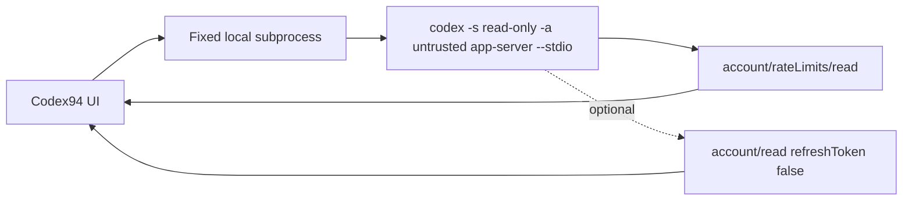

# Codex94

Codex94 is an unofficial, open-source macOS menu bar utility for the quota of the
currently signed-in Codex account. It shows the selected remaining percentage in
a fixed-width ring and opens a compact, CLI-style quota popover.

The app is menu-bar-first and has no Dock icon. Its Dashboard contains connection
state, detected Codex path and version, account permission, menu display mode,
refresh frequency, theme, language, launch-at-login, and redacted diagnostics.

> Codex94 is not affiliated with or endorsed by OpenAI. `app-server` is an
> experimental Codex interface and may change in future Codex releases.

## Requirements

- macOS 14 or later
- Full Xcode 16 or later for local builds
- Codex available from the ChatGPT app, Homebrew, a standard CLI location, or a
  manually selected executable
- A current Codex login for live quota data

## Data flow



Codex94 never receives an access token. It does not make a direct quota HTTP
request and does not read credential files, browser cookies, Keychain entries,
Codex session logs, or SQLite databases. See [SECURITY.md](SECURITY.md).

## Build and run

Accept the Xcode license and finish first-launch setup once:

```bash
sudo xcodebuild -license accept
sudo xcodebuild -runFirstLaunch
```

Then run:

```bash
./script/build_and_run.sh
```

Verification builds, runs the static security check, launches the app, and
confirms the process exists:

```bash
./script/build_and_run.sh --verify
```

Run unit and fake app-server integration tests:

```bash
DEVELOPER_DIR=/Applications/Xcode.app/Contents/Developer \
  xcodebuild -project Codex94.xcodeproj -scheme Codex94 \
  -destination 'platform=macOS' -derivedDataPath .build/DerivedData test
```

## Install

Build a Release app, apply a local ad-hoc Hardened Runtime signature, and install
it to `~/Applications/Codex94.app`:

```bash
./script/install.sh
```

Launch at login is available only from this stable installed path. Developer ID
signing, notarization, releases, and automatic updates are intentionally outside
v1.

## Behavior

- Refreshes at launch, whenever the popover opens, and every 1/5/15/30 minutes.
- Coalesces overlapping refreshes into one app-server process.
- Keeps the last successful quota visible when a refresh fails and marks it stale.
- Hides the 5-hour row and selector whenever Codex does not return that window.
- `Auto` displays the available window with the lowest remaining percentage.
- Offers `Quota + account` and `Quota only` permission modes. Email is shown only
  in Dashboard and is never written to disk.
- Uses only the current Codex login; v1 does not manage multiple accounts or
  alternate `CODEX_HOME` directories.

## Why App Sandbox is off

The first-party Codex subprocess must read its own existing login state. App
Sandbox would prevent that process from reaching the normal Codex home. Codex94
therefore uses Hardened Runtime without App Sandbox, starts only a validated
`codex-cli` executable, passes fixed arguments, supplies a minimal environment,
limits each JSON line to 1 MiB, enforces request timeouts, and terminates the
child after every refresh.

## Uninstall

Disable **Launch at login** in Dashboard, quit Codex94, then remove:

```bash
rm -rf "$HOME/Applications/Codex94.app"
rm -rf "$HOME/Library/Application Support/Codex94"
defaults delete com.defyan94.codex94
```

## License

MIT. See [LICENSE](LICENSE) and [ATTRIBUTIONS.md](ATTRIBUTIONS.md).

