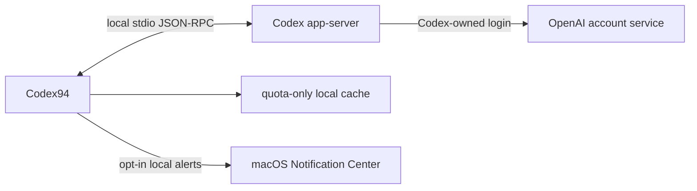

# Codex94

**English** | [简体中文](README.zh-CN.md)

## Overview

Codex94 is an unofficial, independent macOS menu bar quota monitor compatible
with OpenAI Codex. It keeps remaining quota and reset times close at hand,
without a Dock icon. Its compact popover and Dashboard Overview show the quota
buckets and 5-hour or Weekly windows returned by Codex.

The `0.2.2 (13)` candidate offers four menu-bar layouts, including a dual-window
view, optional low-quota and recovery alerts, and a configurable global shortcut.
Either mouse button opens or closes the same popover. A prominent, read-only
**Manual quota resets** card shows the available reset count in both the popover
and Overview; it does not redeem a reset.

Codex94 is an MIT-licensed source project. It uses the Codex executable already
installed on the Mac and has no third-party runtime dependencies.

**Vibe-built with Codex.** Each release is still maintainer-reviewed, tested,
and security-scanned before it is tagged.

> Codex94 is not affiliated with, endorsed by, or sponsored by OpenAI. Codex
> `app-server` is an experimental interface and may change in future Codex
> releases.

## Screenshots

The values below come from an isolated documentation fixture. They are
illustrative and do not contain a real account, identity, or quota.
The embedded popover images remain reviewed synthetic `0.1.8` captures. The
Dashboard image is a reviewed synthetic `0.1.9` Overview capture from
GitHub-hosted CI. Its fixed future Reset dates are test values, not live reset
schedules. The unchanged default menu-bar sample is retained from `v0.1.7`.
These images show their original versions' interfaces. They do not show the
`0.2.2` dual-window layout, notification settings, shortcut control, or new
Manual quota resets card.

<p align="center">
  
</p>
<p align="center"><strong>Compact menu bar status</strong></p>

<p align="center">
  
</p>
<p align="center"><strong>CLI-style quota popover</strong></p>

<p align="center">
  
</p>
<p align="center"><strong>Quota Overview</strong></p>

## Distribution status

- This version PR prepares **0.2.2 (13)**. The candidate package and source
  instructions below target this version, including the new reset-count card.
- The two candidate files are available in the
  [0.2.2 draft Release](https://github.com/DEFY-AN94/codex94/releases/tag/untagged-669c6d0353fbb6e37d32). Drafts require
  maintainer access and are not a public stable release.
- The latest published stable release remains
  [`v0.2.1 (12)`](https://github.com/DEFY-AN94/codex94/releases/tag/v0.2.1).
  Candidate validation, PR review and final publication are recorded separately.
- This public repository can be cloned without GitHub authentication.
- There is no automatic updater.
- `script/install.sh` builds a local Release app, applies an ad-hoc Hardened
  Runtime signature, and installs it at `~/Applications/Codex94.app`.
- The installer requires every Codex94 copy to be quit first. It
  verifies a unique staged copy, uses an installation lock, and preserves the
  old App for rollback until replacement succeeds. It leaves recovery files
  intact if rollback fails; it does not maintain a version archive.

The downloadable DMG itself is completely unsigned, has no Apple Developer ID
signature, and is not notarized by Apple. The `Codex94.app` inside is ad-hoc
signed only. Neither SHA-256 nor GitHub artifact attestation changes that Apple
trust status.

## Requirements

- macOS 14 or later.
- A compatible Codex executable and a current Codex login for live quota data.

DMG installation does not require Xcode. Source installation additionally
requires full Xcode 16.4 or later (Command Line Tools alone are insufficient)
and `ripgrep` (`rg`) for the installer's static security check.

Codex94 can use the Codex executable bundled inside the ChatGPT app, so a
standalone Codex CLI installation is not required when that bundled executable
is compatible. It can also detect Homebrew and standard CLI locations or use an
executable selected manually.

## Install the 0.2.2 candidate DMG

Maintainers can download both files from the
[0.2.2 draft Release](https://github.com/DEFY-AN94/codex94/releases/tag/untagged-669c6d0353fbb6e37d32):

- `Codex94-0.2.2-macos-universal-unnotarized.dmg`
- `Codex94-0.2.2-SHA256SUMS.txt`

The candidate supports Apple Silicon (`arm64`) and Intel (`x86_64`) on macOS
14 or later. Verify the checksum before opening it:

```bash
shasum -a 256 -c Codex94-0.2.2-SHA256SUMS.txt
```

This draft contains the maintainer-tested local build, not a GitHub-attested
final release. SHA-256 identifies the uploaded bytes; it is not Apple signing,
notarization or a security verdict. Public downloads remain available from
[v0.2.1](https://github.com/DEFY-AN94/codex94/releases/tag/v0.2.1) while this PR
and the release are being reviewed.

Quit every running Codex94 copy, open the DMG, and drag `Codex94.app` onto its
`Applications` shortcut. This installs it at `/Applications/Codex94.app`. Do
not run that copy at the same time as a copy in `~/Applications`; both use the
same bundle identifier, preferences, cache, and login-item registration.

Because this technical-user DMG is unsigned and unnotarized, macOS may block
opening it or the first App launch. If you trust the exact verified release,
follow Apple's official
[Privacy & Security → Open Anyway](https://support.apple.com/guide/mac-help/open-a-mac-app-from-an-unknown-developer-mh40616/26/mac/26)
flow. Do not remove quarantine attributes or disable Gatekeeper.

## Install from source

Clone the 0.2.2 version-PR branch (the final release tag is not published yet):

```bash
git clone --branch codex/release-0.2.2 --depth 1 https://github.com/DEFY-AN94/codex94.git
```

Then build that checkout:

```bash
cd codex94
brew install ripgrep

sudo xcodebuild -license accept
sudo xcodebuild -runFirstLaunch

./script/install.sh
```

Quit all Codex94 copies before installing. The installer builds, signs,
installs, and opens `~/Applications/Codex94.app`. Pass `--no-launch` to
install without opening it:

```bash
./script/install.sh --no-launch
```

On first launch, choose whether Codex94 may request **Quota + account** or
**Quota only**. Launch at login accepts exactly the stable
`/Applications/Codex94.app` and `~/Applications/Codex94.app` locations. The
source installer does not migrate or remove a DMG-installed copy.

## Main behavior

The following includes the unreleased `0.2.2 (13)` candidate. The screenshots
above remain historical captures and do not demonstrate its new controls.

- A new Dashboard window starts on **Overview**, which reuses the current
  connection status, freshness context, and menu-bar quota picker, then shows
  every displayable bucket in the existing display order and only the 5-hour or Weekly
  windows actually returned. Missing data has an explicit empty state rather than a fabricated
  `0%`. Opening, browsing, or scrolling Overview does not refresh or write the
  quota cache, and the page does not expose email, executable paths, or raw
  bucket identifiers; the existing Dashboard toolbar remains its refresh entry.
- Choose from four layouts in Dashboard → Display: **Ring + Percentage**,
  **Percentage Only**, **Ring Only**, and the new dual-window layout.
  The original three layouts retain their existing behavior. The running
  menu-bar item changes layout and width immediately without being recreated.
  A status badge is centered in
  a visible ring or occupies a fixed trailing slot in Percentage Only.
- The `0.2.2` candidate adds a fourth dual-window layout, showing the
  selected bucket's 5-hour and Weekly values together. Its saved bucket choice
  is independent of the original three layouts' quota selection. Switching
  layouts preserves those existing choices; an unavailable window is not
  invented or combined with another window.
- Left-clicking or right-clicking the menu-bar item toggles the same popover.
  Opening follows the normal refresh-on-open path. A configurable global
  keyboard shortcut also toggles that popover and is **unset by default**.
  It must include Control or Option; Command and Shift may be added.
- Optional local quota notifications are **off by default**. Explicitly enabling
  them requests macOS notification permission. Remaining-quota warning levels
  start at **20% and 10%** and can be adjusted or disabled. The default bucket
  is monitored, with optional additional buckets and optional recovery alerts.
  Only fresh successful snapshots drive alerts; baselines and per-window-cycle
  deduplication stay in memory. Messages contain the bucket name, window, and
  percentage, without email. macOS Notification Center manages delivered
  notifications and their retention.
- Popover and Overview include a distinct, read-only **Manual quota resets**
  card with a prominent available count. It is an informational card with no
  reset action. Its value comes from the authoritative
  `rateLimitResetCredits.availableCount` in the existing quota response. Zero
  means zero; missing or null data remains unavailable, not zero. Before the
  first live result the card says it has not been fetched; a retained value after
  failure is marked cached. The count stays in memory and is not written to the
  quota cache. Codex94 has no reset-redemption action or consume request.
- Customize four independent colors for healthy
  (50–100%), warning (20–49%), critical (0–19%), and hard-unavailable error
  states. These color thresholds cannot be changed and are separate from the
  configurable notification thresholds. Colors update immediately and are
  stored as opaque sRGB, normalized six-digit uppercase `RRGGBB` values without alpha.
  Critical and error remain independent even when both default to theme red.
  **Restore Default Colors** removes only the four overrides, preserving
  layout, theme, language, quota selection, executable path, and window size.
- Quota rows show a separate absolute **Reset** line
  with the full date, hour/minute, and UTC offset at the reset instant,
  including daylight-saving changes. The existing countdown remains; a
  missing reset is unavailable and a past date stays visible with a zero
  countdown. Dates follow the app language's locale and the current time zone.
  Dashboard → Connection shows the actual resolved menu-bar bucket/window,
  rather than the popover's browsed model.
- Issue banners offer **Open Connection** or
  **Open Diagnostics**, reusing the same Dashboard window. Ordinary Dashboard
  opening preserves its current page. These buttons only navigate; use the
  existing **Refresh** to retry. A signed-out state explains that you must
  sign in in Codex, then return and refresh; Codex94 does not perform login.
- Layout/color changes, Overview rendering, Reset text rendering, and recovery
  navigation do not themselves trigger quota requests, write quota cache, or
  change connection state. Opening the popover and the separate post-reset
  schedule follow their documented refresh behavior below.
- Refreshes at launch, whenever the popover opens, and every 1, 5, 15, or 30
  minutes according to the selected setting.
- After the Mac wakes, refreshes once when there is no successful snapshot or
  the last success is at least 60 seconds old. A fresher snapshot is kept, and
  wake, background, manual, and popover requests share the same single-flight
  refresh path.
- After each successful snapshot, schedules one in-memory refresh for the
  earliest future Reset across displayable windows, strictly at `resetsAt + 5`
  seconds or later. Equal targets are deduplicated, adjacent requests reuse the
  same single-flight path, and a consumed target gets no Reset-specific retry.
  A session-only consumed-target watermark prevents clock rollback from
  rearming an already attempted Reset. Wake and system-clock changes reconcile
  the one-shot schedule without a persistent ledger or new background cadence.
- Uses `account/rateLimits/read` for live quota data. In **Quota + account**
  mode it also uses `account/read` with `refreshToken: false`.
- Keeps the standard/default quota bucket separate from additional named model
  buckets returned by Codex. The default bucket is shown as **Codex**; named
  buckets use service-provided names. No model's availability or retirement
  date is hard-coded. Historical synthetic screenshots may show older names.
- The popover model picker browses one bucket at a time and is independent from
  the menu-bar selection. Browsing a model does not change the menu-bar ring.
  If its browsed bucket disappears, the popover uses the available default
  bucket, or the first displayable bucket when the default has no windows.
  Long bucket names remain distinguishable in the selection menu.
- The dynamic menu-bar quota menu offers `Auto` plus each available bucket and
  window. `Auto` chooses the lowest remaining percentage across all displayable
  buckets and windows. When a fresh successful snapshot no longer contains a
  pinned bucket/window, the saved preference becomes `Auto`. It stays Auto
  if that option later returns; cache loading and failed requests do not
  change the saved selection.
- Supports only the returned 5-hour and Weekly windows. Weekly-only data is
  valid: missing rows and selections are hidden without inferring entitlement
  from plan type. It never estimates or combines independent quota windows.
- Keeps quota severity separate from connection and data freshness: quota
  rings, percentages, and bars share the same resolved healthy/warning/critical
  colors, defaulting to green, amber, and red. Refreshing and cached indicators
  retain the blue/cyan connection accent. A hard-unavailable badge, banner, or
  Dashboard error dot uses its independent error color,
  defaulting to the theme red before any critical override.
- Keeps the last successful quota value after a refresh failure and marks it as
  cached; when no snapshot is available, it shows a gray `--` instead of `0%`.
- Shows the relative age of the last successful quota data in the popover
  header. Refreshing with an existing snapshot reports the last success, while
  refreshing or unavailable states without a snapshot use explicit no-success
  wording. The same freshness context is included in menu-bar and popover
  accessibility descriptions.
- Closes the transient popover when the user clicks elsewhere without consuming
  the original click or requesting Accessibility permission.
- Locates Codex in this order: manually selected path, ChatGPT app bundle,
  Homebrew, `/usr/local/bin`, `~/.local/bin`, then absolute `PATH` entries.
- Offers Dashboard window presets at 900x600, 1280x720, 1440x810, and 1920x1080
  logical points, with proportional fitting to the current display. Screen
  fitting preserves the requested preset; a user resize still updates it.
- Dashboard → Startup refreshes Launch at Login status when returning to
  the app and shows a localized failure if a requested change fails. Automated
  tests use a fake service and never change real Login Items.
- The executable picker follows the app's selected language.
- Dashboard → About shows this candidate tree's exact value `0.2.2 (13)`. A
  user-triggered copy action preserves that string, and the project link targets
  `https://github.com/DEFY-AN94/codex94`. It adds no updater or network client.
- Supports system, Terminal Dark, and Terminal Light themes plus English and
  Simplified Chinese.
- Uses only the current Codex login. It does not manage multiple accounts or
  alternate `CODEX_HOME` directories, collect quota history, or provide an updater.

## Security and privacy



Codex94 starts the validated executable with fixed arguments:

```text
codex -s read-only -a never app-server --stdio
```

Codex itself owns authentication and may contact OpenAI services. Codex94 does
not implement OAuth, receive an access or refresh token, make a direct quota
HTTP request, or read authentication files, browser cookies, Keychain entries,
Codex session logs, or SQLite databases.

The versioned local cache stores only quota-bucket identifiers and optional
names, plan type, window duration and type, percentage, reset time, and fetch
time with owner-only permissions. Email is memory-only in **Quota + account**
mode and is removed from the in-memory snapshot after switching to **Quota
only**. UserDefaults stores interface choices, including the preferred menu-bar
quota selection, and an optional manually selected executable path. Version
0.1.8 introduced `menuBarLayout.v1` and `statusAccentOverrides.v1` for layout
and four color overrides; subsequent releases reuse those keys and migration.
Version 0.2.1 changes an unavailable pinned selection to Auto only after a
successful fresh snapshot, using the existing preference key. Reset text and the in-memory post-reset
schedule use the existing reset timestamp, with no additional cache fields or
persistent ledger. Overview uses the existing snapshot without storing new
identity data. The popover's browsed model and the Dashboard's selected section
are session-only; Dashboard frame autosave is unchanged.
The `0.2.2` candidate adds `dualWindowBucketSelection.v1`, `globalHotKey.v1`,
and `notifications.v1` preferences for the independent dual-window bucket,
chosen shortcut, and alert settings. Notification baselines, deduplication, and
the reset-credit count are memory-only; cache schema v2 is unchanged. The
shortcut uses system hotkey registration and does not record typed text.
Opt-in notifications use the local macOS notification service, which can retain
delivered bucket/window/percentage messages in Notification Center. This is an
explicit new permission and local system data flow, not remote telemetry.
Codex94 has no analytics, advertising,
telemetry upload, crash-reporting SDK, update checker, or project-operated
server.

Version 0.2.0 added distribution packaging and the second stable installation
path. Version 0.2.1 retains the same data and permission boundaries. The DMG, checksum, and CI artifact contain the App, not account data,
credentials, preferences, cache, logs, or real quota. Browser download and
Gatekeeper quarantine handling are macOS distribution behavior; they do not add
a Codex94 network client, data collection, entitlement, or permission.

App Sandbox is intentionally disabled because the Codex child process must
access its own login state. Hardened Runtime remains enabled; subprocess
arguments are fixed, the environment is minimized, output is bounded, requests
time out, and the process group is terminated after each refresh or during app
shutdown with bounded cleanup. Version validation checks protocol compatibility,
not publisher identity, so users must trust the ChatGPT/Codex installation and
any executable they select.

The Diagnostics and About copy buttons write only after a user action. Copied
diagnostics normalize the executable path and version; About copies the exact
displayed version and build. Users should still review diagnostics before
sharing them. Codex94 never reads or uploads clipboard contents or diagnostics.

See [PRIVACY.md](PRIVACY.md) and [SECURITY.md](SECURITY.md) for the complete
boundaries.

## Development and build

Contributor and release checks also require `jq`:

```bash
brew install ripgrep jq
```

Build and run a Debug app:

```bash
./script/build_and_run.sh
```

`build_and_run.sh` stops existing named Codex94 processes before building and
launches the Debug app. `install.sh` asks you to quit running
copies instead of stopping them, replaces only its installation path, and may
launch the installed App. These scripts are not read-only checks; local app runs can
use the same preferences and cache as the installed app.

Use synthetic fixtures and injected fetchers or an explicit fake executable
for automated tests and documentation screenshots. Do not include real account
credentials, identity, quota, or private paths in shared fixtures or artifacts.
Keep test preferences and cache separate from daily app data; see
[CONTRIBUTING.md](CONTRIBUTING.md).

Run the unit and fake app-server integration tests:

```bash
DEVELOPER_DIR=/Applications/Xcode_16.4.app/Contents/Developer \
  xcodebuild -project Codex94.xcodeproj -scheme Codex94 \
  -destination 'platform=macOS' -derivedDataPath .build/DerivedData \
  CODE_SIGNING_ALLOWED=NO test
```

Run the complete release gate, including isolated metadata/installer tests,
hosted tests, one Universal Release build, and DMG create/verify.
`script/release_metadata.py` reads the App target's version/build; CI and the
UI fixture use the committed values. The packager owns the complete App
signature and payload validation:

```bash
./script/release_check.sh
```

Version 0.1.8 passed the full GitHub test/release job, synthetic Display and
click-functional Recovery UI jobs, and Actions/Swift CodeQL. For `0.1.9 (10)`,
PR #11 remains the historical record for exact-head test, Display/Recovery UI,
Actions/Python/Swift CodeQL, and final App acceptance. The synthetic Overview
capture embedded above has been reviewed for layout and privacy. Keyboard
activation, AXPress, and hosted tooltip exposure are not claimed as passed.
Version [`0.2.1 (12)`](https://github.com/DEFY-AN94/codex94/releases/tag/v0.2.1)
is published. Every release needs its own test results, reviewed synthetic UI
evidence, candidate App acceptance before Ready, and final CI DMG acceptance
before publication. Earlier evidence does not prove a later candidate passed.

SwiftUI owns views and state presentation; AppKit owns the status item, popover,
application appearance, and Dashboard window lifecycle. See
[CONTRIBUTING.md](CONTRIBUTING.md) and [docs/RELEASING.md](docs/RELEASING.md)
for contribution and release workflows.

## Uninstall

First disable **Launch at login** in Dashboard and quit every Codex94 copy.
Remove only the App locations that you actually installed; neither installer
automatically removes the other copy:

```bash
rm -rf "/Applications/Codex94.app"
rm -rf "$HOME/Applications/Codex94.app"
```

Removing the App does not remove its local data. To remove that too, separately
delete the cache and preferences:

```bash
rm -rf "$HOME/Library/Application Support/Codex94"
defaults delete com.defyan94.codex94
```

## License

Codex94 is licensed under the [MIT License](LICENSE). See
[ATTRIBUTIONS.md](ATTRIBUTIONS.md) for design and implementation references.

Codex and ChatGPT are trademarks of OpenAI. Codex94 is an independent,
unofficial project and does not use the OpenAI logo.
