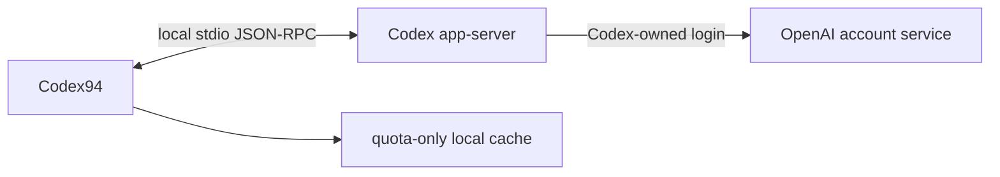

# Codex94

Codex94 is an unofficial, open-source macOS menu bar utility for the quota of the
currently signed-in Codex account. It shows the selected remaining percentage in
a fixed-width ring and opens a compact, CLI-style quota popover.

The app is menu-bar-first and has no Dock icon. Its Dashboard contains connection
state, detected Codex path and version, account permission, menu display mode,
refresh frequency, window-size presets, theme, language, launch-at-login,
redacted diagnostics, and app/creator information.

> Codex94 is not affiliated with or endorsed by OpenAI. `app-server` is an
> experimental Codex interface and may change in future Codex releases.

This repository currently publishes source code only. Local builds are ad-hoc
signed and are not notarized for public binary distribution.

## Requirements

- macOS 14 or later
- Full Xcode 16 or later for local builds
- `ripgrep` (`rg`) and `jq` for security and release checks
- Codex available from the ChatGPT app, Homebrew, a standard CLI location, or a
  manually selected executable
- A current Codex login for live quota data

With Homebrew, install the command-line prerequisites using
`brew install ripgrep jq`.

## Data flow



Codex94 requests `account/rateLimits/read` and, when enabled,
`account/read(refreshToken: false)`. The Codex child may contact OpenAI services,
but Codex94 never receives an access token. It does not make a direct quota HTTP
request or read credential files, browser cookies, Keychain entries, Codex
session logs, or SQLite databases. See [PRIVACY.md](PRIVACY.md) and
[SECURITY.md](SECURITY.md).

## Architecture

- `App` owns status-item, popover, appearance, and Dashboard window lifecycle.
- `Stores` owns refresh coalescing, UI state, and preference persistence.
- `Services` owns executable discovery, bounded JSON-RPC, cache, and login items.
- `Models` and `Support` contain quota selection, formatting, localization, and
  redaction logic.
- `Views` are SwiftUI presentation and do not access credentials or the network.

There are no third-party runtime dependencies.

## Build and run

Accept the Xcode license and finish first-launch setup once:

```bash
sudo xcodebuild -license accept
sudo xcodebuild -runFirstLaunch
```

Then run:

```bash
./script/build_and_run.sh
```

Verification builds, runs the static security check, launches the app, and
confirms the process exists:

```bash
./script/build_and_run.sh --verify
```

Run unit and fake app-server integration tests:

```bash
DEVELOPER_DIR=/Applications/Xcode.app/Contents/Developer \
  xcodebuild -project Codex94.xcodeproj -scheme Codex94 \
  -destination 'platform=macOS' -derivedDataPath .build/DerivedData \
  CODE_SIGNING_ALLOWED=NO test
```

Before publishing a commit or tag, run the complete release gate:

```bash
./script/release_check.sh
```

## Install

Build a Release app, apply a local ad-hoc Hardened Runtime signature, and install
it to `~/Applications/Codex94.app`:

```bash
./script/install.sh
```

Launch at login is available only from this stable installed path. Developer ID
signing, notarization, releases, and automatic updates are intentionally outside
v1.

## Behavior

- Refreshes at launch, whenever the popover opens, and every 1/5/15/30 minutes.
- Closes the transient popover when the user clicks elsewhere without consuming
  the original click or requesting Accessibility permission.
- Runs at most one app-server process, coalesces ordinary duplicate refreshes,
  and queues one replacement refresh when a connection preference changes.
- Keeps the last successful quota visible when a refresh fails and marks it stale.
- Hides the 5-hour row and selector whenever Codex does not return that window.
- `Auto` displays the available window with the lowest remaining percentage.
- Resizes Dashboard to 900x600, 1280x720, 1440x810, or 1920x1080 logical
  points, proportionally fitting oversized presets to the current display.
- Offers `Quota + account` and `Quota only` permission modes. Email is shown only
  in Dashboard and is never written to disk.
- Uses only the current Codex login; v1 does not manage multiple accounts or
  alternate `CODEX_HOME` directories.

## Why App Sandbox is off

The first-party Codex subprocess must read its own existing login state. App
Sandbox would prevent that process from reaching the normal Codex home. Codex94
therefore uses Hardened Runtime without App Sandbox, starts only a validated
`codex-cli` executable, passes fixed arguments, supplies a minimal environment,
limits each JSON line to 1 MiB, enforces request timeouts, and terminates the
child after every refresh.

Version validation confirms protocol compatibility, not publisher identity.
Codex94 executes the detected or manually selected binary, so users must trust
their ChatGPT/Codex installation and any executable they select. Relative `PATH`
entries are ignored.

## Uninstall

Disable **Launch at login** in Dashboard, quit Codex94, then remove:

```bash
rm -rf "$HOME/Applications/Codex94.app"
rm -rf "$HOME/Library/Application Support/Codex94"
defaults delete com.defyan94.codex94
```

## License

MIT. See [LICENSE](LICENSE) and [ATTRIBUTIONS.md](ATTRIBUTIONS.md).

See [CONTRIBUTING.md](CONTRIBUTING.md) for changes and
[docs/RELEASING.md](docs/RELEASING.md) for the source-first GitHub publishing
checklist.
