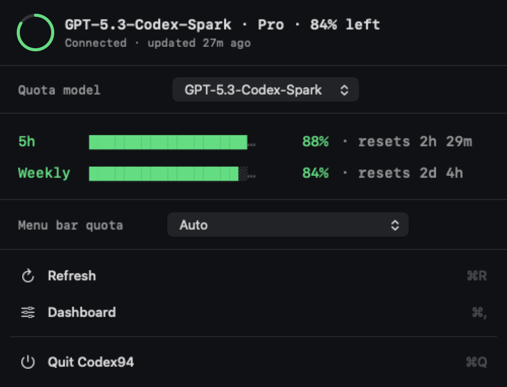
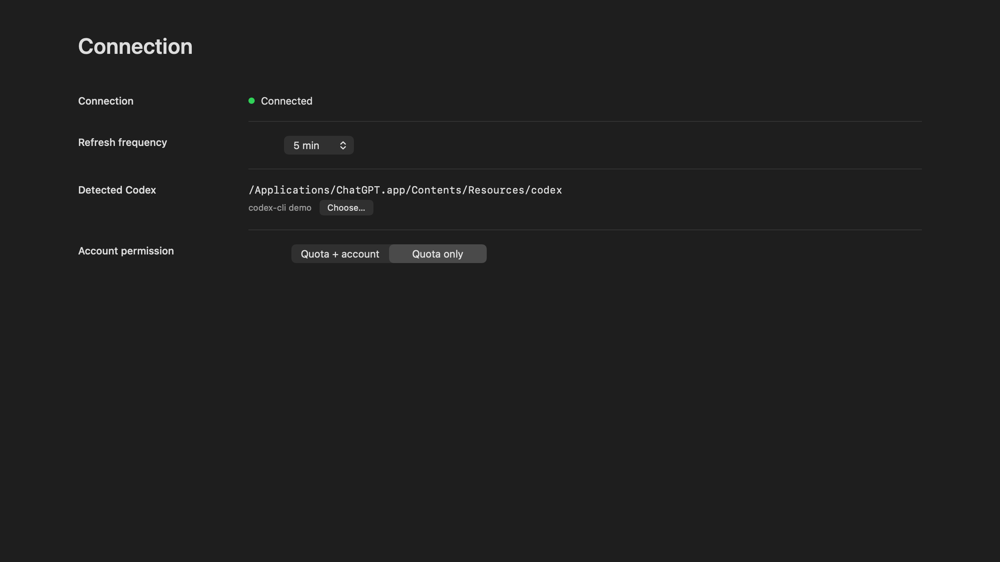
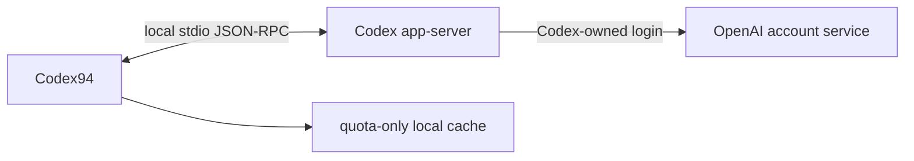

# Codex94

**English** | [简体中文](README.zh-CN.md)

## Overview

Codex94 is an unofficial, independent macOS menu bar quota monitor compatible
with OpenAI Codex. A compact ring shows the selected model bucket and quota
window's percentage remaining; clicking it opens a CLI-style quota popover. The
app has no Dock icon, and its Dashboard is focused on connection and display
settings.

Codex94 is an MIT-licensed source project. It uses the Codex executable already
installed on the Mac and has no third-party runtime dependencies.

**Vibe-built with Codex.** Each source release is still maintainer-reviewed,
tested, and security-scanned before it is tagged.

> Codex94 is not affiliated with, endorsed by, or sponsored by OpenAI. Codex
> `app-server` is an experimental interface and may change in future Codex
> releases.

## Screenshots

The values below come from an isolated documentation fixture. They are
illustrative and do not contain a real account, identity, or quota.

<p align="center">
  
</p>
<p align="center"><strong>Compact menu bar status</strong></p>

<p align="center">
  
</p>
<p align="center"><strong>CLI-style quota popover</strong></p>

<p align="center">
  
</p>
<p align="center"><strong>Connection Dashboard</strong></p>

## Distribution status

- This source version is `0.1.7 (8)`; its stable source tag is `v0.1.7`.
- A source release is available only after its tag is published. `main` may
  contain release preparation.
- This public repository can be cloned without GitHub authentication.
- There is no GitHub Release, DMG, notarized binary, or automatic updater.
- `script/install.sh` builds a local Release app, applies an ad-hoc Hardened
  Runtime signature, and installs it at `~/Applications/Codex94.app`.
- Re-running the installer replaces that one app in place; it does not retain a
  separate copy for each version.

Do not present a locally ad-hoc-signed build as a publicly notarized download.

## Requirements

- macOS 14 or later.
- Full Xcode 16.4 or later. Command Line Tools alone are insufficient.
- `ripgrep` (`rg`) for the installer's static security check.
- A compatible Codex executable and a current Codex login for live quota data.

Codex94 can use the Codex executable bundled inside the ChatGPT app, so a
standalone Codex CLI installation is not required when that bundled executable
is compatible. It can also detect Homebrew and standard CLI locations or use an
executable selected manually.

## Install from source

After `v0.1.7` is published, install its stable source with:

```bash
brew install ripgrep
git clone --branch v0.1.7 --depth 1 https://github.com/DEFY-AN94/codex94.git
cd codex94

sudo xcodebuild -license accept
sudo xcodebuild -runFirstLaunch

./script/install.sh
```

The installer builds, signs, installs, and opens
`~/Applications/Codex94.app`. Pass `--no-launch` to install without opening
it:

```bash
./script/install.sh --no-launch
```

On first launch, choose whether Codex94 may request **Quota + account** or
**Quota only**. Launch at login can be enabled only after the app is installed
at the stable path above.

## Main behavior

- Refreshes at launch, whenever the popover opens, and every 1, 5, 15, or 30
  minutes according to the selected setting.
- After the Mac wakes, refreshes once when there is no successful snapshot or
  the last success is at least 60 seconds old. A fresher snapshot is kept, and
  wake, background, manual, and popover requests share the same single-flight
  refresh path.
- Uses `account/rateLimits/read` for live quota data. In **Quota + account**
  mode it also uses `account/read` with `refreshToken: false`.
- Keeps the standard/default quota bucket separate from additional named model
  buckets returned by Codex. The default bucket is shown as **Codex**; named
  buckets use the service-provided name, such as **Spark**.
- The popover model picker browses one bucket at a time and is independent from
  the menu-bar selection. Browsing a model does not change the menu-bar ring.
- The dynamic menu-bar quota menu offers `Auto` plus each available bucket and
  window. `Auto` chooses the lowest remaining percentage across all displayable
  buckets and windows.
- Hides a 5-hour or Weekly row and its selection whenever Codex does not return
  that window; it never estimates or combines independent quota windows.
- Keeps quota severity separate from connection and data freshness: quota
  rings, percentages, and bars remain green, amber, or red according to the
  remaining percentage, while refreshing, cached, and unavailable states use
  distinct blue/cyan icons and text.
- Keeps the last successful quota value after a refresh failure and marks it as
  cached; when no snapshot is available, it shows a gray `--` instead of `0%`.
- Shows the relative age of the last successful quota data in the popover
  header. Refreshing with an existing snapshot reports the last success, while
  refreshing or unavailable states without a snapshot use explicit no-success
  wording. The same freshness context is included in menu-bar and popover
  accessibility descriptions.
- Closes the transient popover when the user clicks elsewhere without consuming
  the original click or requesting Accessibility permission.
- Locates Codex in this order: manually selected path, ChatGPT app bundle,
  Homebrew, `/usr/local/bin`, `~/.local/bin`, then absolute `PATH` entries.
- Offers Dashboard window presets at 900x600, 1280x720, 1440x810, and 1920x1080
  logical points, with proportional fitting to the current display.
- Supports system, Terminal Dark, and Terminal Light themes plus English and
  Simplified Chinese.
- Uses only the current Codex login. It does not manage multiple accounts or
  alternate `CODEX_HOME` directories.

## Security and privacy



Codex94 starts the validated executable with fixed arguments:

```text
codex -s read-only -a never app-server --stdio
```

Codex itself owns authentication and may contact OpenAI services. Codex94 does
not implement OAuth, receive an access or refresh token, make a direct quota
HTTP request, or read authentication files, browser cookies, Keychain entries,
Codex session logs, or SQLite databases.

The versioned local cache stores only quota-bucket identifiers and optional
names, plan type, window duration and type, percentage, reset time, and fetch
time with owner-only permissions. Email is memory-only in **Quota + account**
mode and is removed from the in-memory snapshot after switching to **Quota
only**. UserDefaults stores interface choices, including the preferred menu-bar
quota selection, and an optional manually selected executable path. The
popover's browsed model is session-only. Codex94 has no analytics, advertising,
telemetry upload, crash-reporting SDK, update checker, or project-operated
server.

App Sandbox is intentionally disabled because the Codex child process must
access its own login state. Hardened Runtime remains enabled; subprocess
arguments are fixed, the environment is minimized, output is bounded, requests
time out, and the process group is terminated after each refresh or during app
shutdown with bounded cleanup. Version validation checks protocol compatibility,
not publisher identity, so users must trust the ChatGPT/Codex installation and
any executable they select.

Copied diagnostics normalize the executable path and version before writing the
text to the system clipboard. Users should still review that text before sharing
it. Codex94 never uploads diagnostics.

See [PRIVACY.md](PRIVACY.md) and [SECURITY.md](SECURITY.md) for the complete
boundaries.

## Development and build

Contributor and release checks also require `jq`:

```bash
brew install ripgrep jq
```

Build and run a Debug app:

```bash
./script/build_and_run.sh
```

Run the static security check, build, launch, and verify the process:

```bash
./script/build_and_run.sh --verify
```

Run the unit and fake app-server integration tests:

```bash
DEVELOPER_DIR=/Applications/Xcode.app/Contents/Developer \
  xcodebuild -project Codex94.xcodeproj -scheme Codex94 \
  -destination 'platform=macOS' -derivedDataPath .build/DerivedData \
  CODE_SIGNING_ALLOWED=NO test
```

Run the complete local release gate:

```bash
./script/release_check.sh
```

SwiftUI owns views and state presentation; AppKit owns the status item, popover,
application appearance, and Dashboard window lifecycle. See
[CONTRIBUTING.md](CONTRIBUTING.md) and [docs/RELEASING.md](docs/RELEASING.md)
for contribution and release workflows.

## Uninstall

First disable **Launch at login** in Dashboard and quit Codex94. Then remove the
installed app, local cache, and preferences:

```bash
rm -rf "$HOME/Applications/Codex94.app"
rm -rf "$HOME/Library/Application Support/Codex94"
defaults delete com.defyan94.codex94
```

## License

Codex94 is licensed under the [MIT License](LICENSE). See
[ATTRIBUTIONS.md](ATTRIBUTIONS.md) for design and implementation references.

Codex and ChatGPT are trademarks of OpenAI. Codex94 is an independent,
unofficial project and does not use the OpenAI logo.
