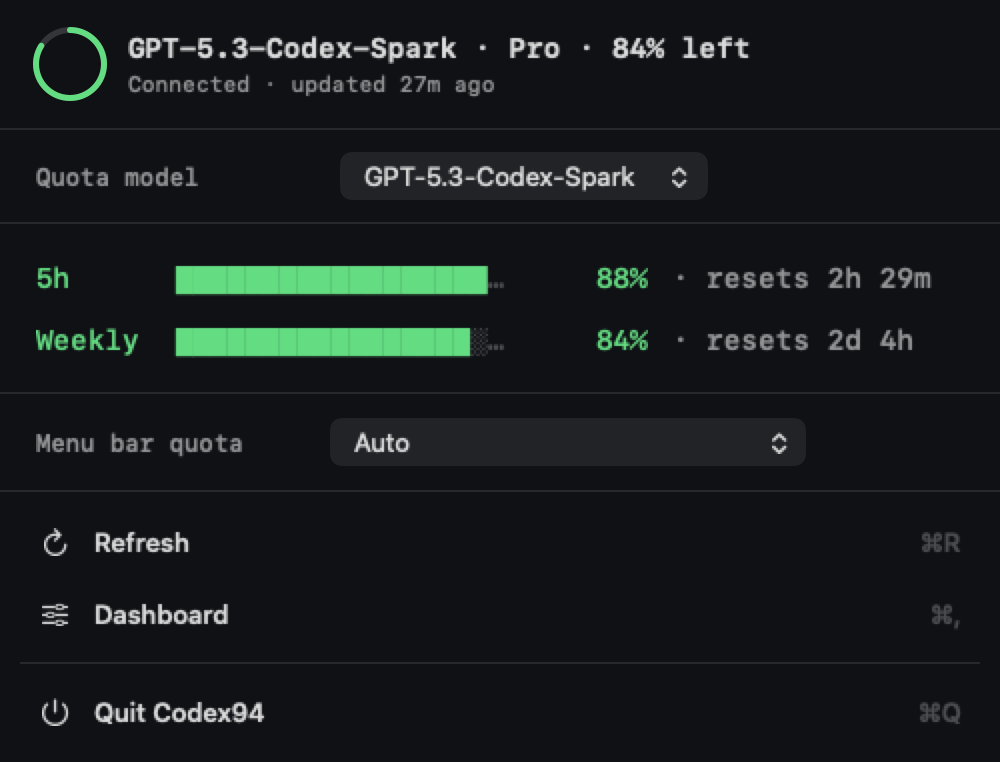
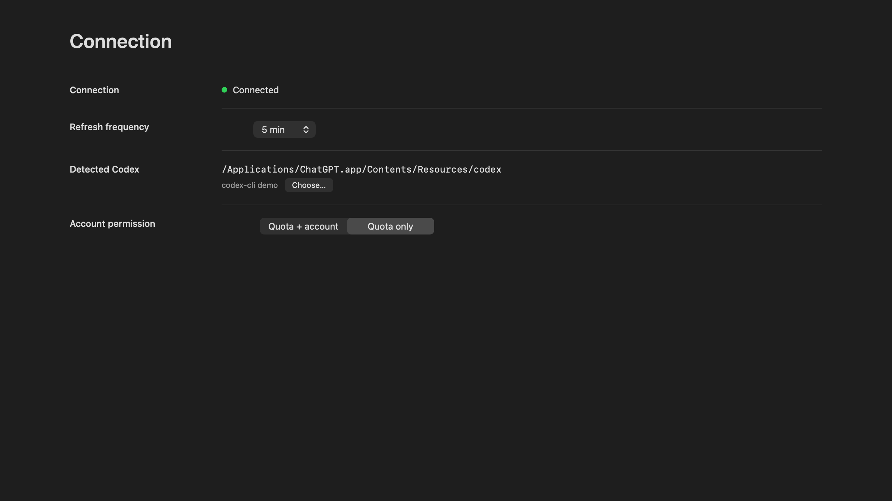
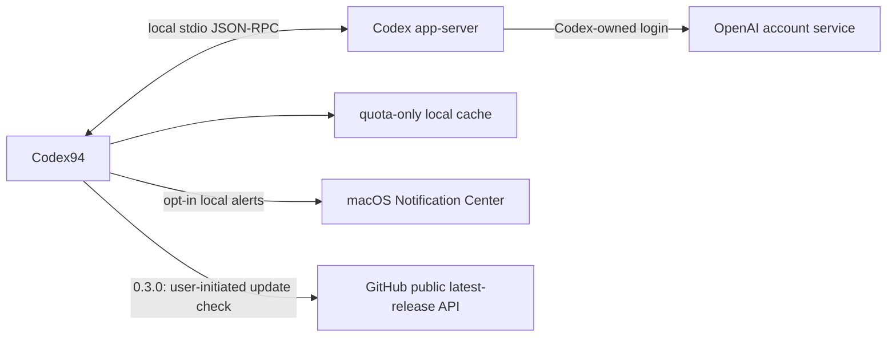

# Codex94

**English** | [简体中文](README.zh-CN.md)

## Overview

Codex94 is an unofficial, independent macOS app for **Codex and Claude Code
quota monitoring**, with **Codex Token usage statistics**. Codex is on by default;
Claude is optional and defaults to passive local reports. Remaining quota and
reset times stay in the menu bar without a Dock icon, with details in one
popover and Dashboard.

Version `0.3.0 (14)` adds Codex service-reported summary cards, switchable **bar
and line charts**, and **CSV export** of daily Token records. A manual update check
shows newer stable GitHub Releases; downloading and installing remain manual.

The quota features introduced in `0.2.2 (13)` remain: four menu-bar layouts,
including a dual-window view, optional low-quota and recovery alerts, and a
configurable global shortcut. Either mouse button toggles the same popover.
The read-only **Manual quota resets** display shows the available reset count in
the popover and Overview without redeeming a reset.

Codex94 is an MIT-licensed source project. Codex monitoring uses the locally
installed Codex CLI; Claude defaults to reading existing local status-line
reports. No third-party runtime frameworks are bundled.

**Vibe-built with Codex.** Each release is still maintainer-reviewed, tested,
and security-scanned before it is tagged.

> Codex94 is not affiliated with, endorsed by, or sponsored by OpenAI or
> Anthropic. Codex `app-server` is experimental; CLI and status-line formats
> may change between upstream releases.

## 4.1.0 candidate (unreleased)

The development version is **4.1.0 (24)** on branch
`claude/4.1.0-local-usage-cache`. Stable downloads below remain on 4.0.1 until
publication of the new release is confirmed. The `4.0.2 (23)` candidate (the
notification-callback fix, large separate service cards, compact dual rings and
the statusline-scope explanation) was merge-ready but never tagged or
published; 4.1.0 carries those changes forward unchanged.

4.1.0 changes the Claude side only. Codex behavior is unchanged.

- **Claude Code's local usage cache becomes the primary source.** Claude Code
  writes the result of its own plan-usage fetch (the data behind its `/usage`
  screen) into its global state file `~/.claude.json` under the key
  `cachedUsageUtilization`; Claude Code 2.1.208 and later keep this last-known
  usage. Codex94 reads only that key and shows the 5-hour and 7-day
  utilization, their reset times, and the time Claude Code fetched them. If
  `CLAUDE_CONFIG_DIR` is set in Codex94's own environment, the file is read
  from that directory instead, mirroring Claude Code.
- **Three tiers, one report at a time.** The existing status-line connection
  becomes the backup: it is used when its report is strictly newer than the
  cache, or when the cache is absent or unreadable. The optional CLI `/usage`
  read stays default-off with its quota-consumption warning and becomes the
  last option; it is no longer mutually exclusive with the passive sources, its
  result simply joins the selection, and disabling it discards only CLI data.
  The newest valid report wins and the cache wins ties. Percentages from
  different sources are never averaged or merged. Tiers of the same account
  share one notification baseline; only a different login, a different
  status-line producer or a rejected CLI login resets it.
- **Read once with the CLI.** Dashboard → **Services** gains a button that runs
  the official CLI exactly once regardless of the CLI switch, with the same
  warning. Claude Code then refreshes its own cache, which the primary source
  picks up.
- **Per-model weekly limits.** Model-scoped weekly limits from the cache (for
  example a Fable weekly limit) appear as extra Claude quota buckets: listed
  under **Per-model weekly limits** on the card, selectable in the menu-bar
  quota picker, and eligible for the automatic most-constrained selection.
- **Freshness and presentation.** A cache report counts as current for 60
  minutes after Claude Code fetched it, matching Claude Code's own last-known
  rule; after that the amber cached marker and the data time appear while the
  numbers stay visible. Status-line reports keep the existing 10-minute rule;
  CLI reads keep the larger of 10 minutes and the refresh interval plus 60
  seconds. Windows whose reset time has passed disappear and are never shown
  as 100% remaining. The card names the source (**Claude Code local cache**),
  shows **Claude Code fetched** with the fetch time, and has explicit empty
  states for no cache yet (run `claude` in a terminal and enter `/usage`, or
  use the one-time CLI read), an unreadable cache, and expired windows.
  Services gains a read-only **Claude data sources** section describing the
  three tiers and showing the current source and local-cache state.
  Diagnostics export gains a `claudeLocalCache` line
  (absent/valid/unreadable/invalid, or none while Claude monitoring is off)
  with no path or account identifier.

**Privacy boundary.** `~/.claude.json` also contains the account email,
organization, project paths and MCP settings. Codex94 opens it read-only with
`O_NOFOLLOW`, refuses symlinks, hard-linked files, foreign owners, non-regular
files and files over 16 MiB, parses only `cachedUsageUtilization`, and discards
everything else immediately; nothing from the file beyond the quota fields
above is retained, logged or exported. The account UUID is compared in memory
only to detect a different login, which resets the notification baseline, and
is never persisted. The reader never writes the file and re-parses it only
when its size, modification time or inode changes. Preference keys are unchanged
(`claude.cliUsageEnabled.v1` keeps its meaning); no new preference, cache file,
entitlement, network endpoint or installer step is added.

**No OAuth or credential access.** [Anthropic's legal page](https://code.claude.com/docs/en/legal-and-compliance#authentication-and-credential-use)
(2026-02-20) restricts OAuth tokens to Claude Code and native Anthropic apps
and forbids third parties from collecting, storing or intermediating Claude.ai
credentials or session tokens. Codex94 therefore reads only files that the
official client leaves on the Mac. `AppUpdateClient.swift` remains the only
network client; no HTTP/OAuth client, Keychain, cookie or token reading was
added. `script/security_check.sh` additionally rejects credential-file names,
the Claude Code Keychain item name, `SecItem`/`SecKeychain` calls and the OAuth
usage endpoint string in production sources, and allows the literal
`claude.json` only in the cache reader. The paused OAuth work lives in draft
[PR #44](https://github.com/DEFY-AN94/codex94/pull/44) and is not part of 4.1.0.

The App target and the UI test bundle build locally on Xcode 27.0, and the
hosted unit suite passed there: 544 tests executed, 1 existing hosted-focus
skip, 0 failures. The metadata, installer and security-scanner script
self-tests also passed locally, and `script/release_check.sh` passed locally on
Xcode 27.0 for `4.1.0 (24)`, verifying the Universal App and an unsigned DMG
candidate (a local artifact, not the release asset). On CI (Xcode 16.4) the
`test` job and four of the five UI smokes passed for the first PR heads; the
providers smoke failed twice on test-side causes that were corrected afterwards
(an exact-text assertion predating the cached-data prefix, then a fixture whose
scoped Fable limit was the tightest window and relabelled the native item), so
its rerun, candidate acceptance, tag, the CI DMG and publication are pending. The Providers UI smoke fixture seeds a synthetic
`.claude.json` through `CLAUDE_CONFIG_DIR` and checks that turning the CLI
option off shows the cache source without launching the CLI; it counts as
evidence only after it runs on CI. The historical screenshots and release
results below are not 4.1.0 validation.

## Version 4.0.1

`4.0.1 (22)` is the published stable release, dated **2026-10-03**
(Australia/Melbourne). It carries forward the dual-provider features from the
unpublished 4.0.0 candidate. The `v4.0.0` tag remains unchanged and its Draft
Release was removed; its validation records below remain historical.

Claude uses **passive local status-line reports by default**. Direct
OAuth access is deferred: [Anthropic's credential-use rules](https://code.claude.com/docs/en/legal-and-compliance#authentication-and-credential-use)
do not establish permission for this third-party app to reuse subscription
credentials. No OAuth credential reader, token refresh or Claude HTTP client is
included. Live `/usage` probing remains suspended; that reader is a separate,
default-off option with a quota-consumption warning.

Passive reports arrive when you normally use Claude Code; Codex94 does not start
a session or send a prompt to produce them. Signing in to Claude App or the web
alone does not generate a Code statusline report. The quota fields appear only
after Claude Code receives an API response in that session, as documented in the
[official statusline reference](https://code.claude.com/docs/en/statusline#available-data).
The official status-line schema has
no verified account ID. Reports are labelled account-unverified, CLI mode never
automatically falls back to them, and a different reporting session requires
explicit adoption. A session fingerprint identifies a report stream, not an
account. Unchanged reports keep their original local report time; expired windows
become unknown rather than being reset to 100%.

- **Codex is on by default; Claude is off.** Enable Claude in Dashboard →
  **Services**. Each service has its own refresh tasks, quota selection, source,
  freshness, failures and opt-in notification settings. One service's failure
  does not replace the other's quota.
- Choose **one menu-bar service** or **two independent status items**. Either
  item opens the same scrollable popover containing all enabled services as
  separate sections. Overview also shows the enabled services. The Codex group
  picker, account options and read-only reset-credit display remain available.
- Choose the floating window's service separately from the primary menu-bar
  service. Disabling a service stops its monitoring and reminders. With both
  off, a neutral status item keeps Services settings reachable.
- Claude quota can come from a **status-line connection**, or the official CLI's
  **`/usage` screen** only after separately enabling the CLI option. The card identifies the source and
  report time, preserves reported fractions, and leaves missing quota/reset
  values unknown. It does not combine Codex and Claude percentages.
- A status-line report is local information emitted by Claude Code, not a new
  cloud quota sample. Rereading an unchanged report does not update its report
  time. Services settings can preview and install a wrapper that preserves the
  existing status-line command; removal restores it only if the configuration
  still matches. Turning monitoring off leaves that connection installed but
  stops quota capture; removing it is a separate action.
- **Token statistics, charts, CSV/PNG export and chart copying remain Codex
  only.** Disabling Codex monitoring disables that page's data reads. Claude
  token/cost analytics are not part of this implementation.

## Earlier 3.1.4 release

`3.1.4 (20)` was released on **2026-09-28** (Australia/Melbourne). It gave
Codex quota reads more time to complete; these features remain. Transient
failures retry after 5, 20 and 60 seconds. Between attempts, the last successful
quota remains visible with an amber cached indicator and the failure reason.
The popover, Connection page and menu-bar tooltip show the next automatic
attempt when its scheduled time is known. See
[issue #36](https://github.com/DEFY-AN94/codex94/issues/36) and [fix PR](https://github.com/DEFY-AN94/codex94/pull/37).

### Earlier 3.1.3 release

`3.1.3 (19)` was released on **2026-09-28**
(Australia/Melbourne). It reads quota before optional account details, keeps
valid quota when optional identity is slow, and recovers transient quota
failures with a bounded retry budget. Reopening a connected popover with data
less than 60 seconds old reuses that snapshot. Cached status has an independent
amber clock; active refresh remains blue. Colored menu-bar content now uses a
transparent, sRGB, non-template native button image, with freshness in its
tooltip. See [issue #33](https://github.com/DEFY-AN94/codex94/issues/33) and
[fix PR #34](https://github.com/DEFY-AN94/codex94/pull/34).

The maintainer confirmed that the reported menu-bar color flash while switching
Spaces was resolved on the tested Mac with the exact reviewed CI candidate.
This acceptance does not establish behavior on every macOS version, fullscreen
configuration, or keyboard path. The candidate identity and scope are recorded
in the [release record](docs/RELEASING.md).

The bundled-CLI compatibility fix introduced in `3.1.2 (18)` is retained,
including discovery of the known ChatGPT/Codex App layouts, legacy fallbacks,
and explicit manual-path precedence. Its original record remains
[issue #30](https://github.com/DEFY-AN94/codex94/issues/30) and
[PR #31](https://github.com/DEFY-AN94/codex94/pull/31).

## Features

The service controls above extend these existing Codex and display features.

- The floating quota strip targets **480 × 90 logical points** for weekly-only
  or cold data and **680 × 90** when a 5-hour window is reported. It supports
  pin, drag, hide, and expand controls. It reuses existing quota data; hovering or focusing
  the update-time control reveals manual refresh. It adds no polling or credit
  redemption, and the existing global shortcut still toggles the popover.
- **Custom** start/end dates join the three existing Token ranges. Dates use
  source calendar-day labels. Reported average, selected-interval peak, and
  coverage stay separate from the service summary cards. Comparison includes
  the preceding equal-length interval's reported total and coverage; a growth
  percentage requires complete data in both intervals and a nonzero baseline.
- **Export PNG…** and **Copy chart image** use the current range, bar/line style,
  language, and theme. The image contains the chart, date range, fetch time,
  coverage, and any stale-data notice, without identity. Copying writes to the
  system clipboard only when clicked; CSV export remains available.
- Floating preferences save pin state and position; 4.0 also saves the selected
  service. Adaptive width is still derived from quota data. The app has no
  statistics history database, and distribution signing and manual installation
  remain unchanged.

Validation includes a fourth synthetic **Floating** UI scenario and Token
controls/image checks. Evidence is listed below. Native keyboard focus,
floating-panel behavior across Spaces, and fullscreen behavior remain separate
from rendered images and panel flags; the earlier 3.1.3 menu-bar color acceptance
is limited to its tested Mac and candidate.

## Screenshots

All screenshots use isolated synthetic data, not a real account or live usage.
These retained captures do not show the 4.1.0 candidate's revised presentation.
The chart previews were captured during `0.3.0 (14)` candidate testing and
show **Bar chart** and **Line chart** over the same seven reported days. These
original synthetic captures remain unchanged, from [CI run 35521556558](https://github.com/DEFY-AN94/codex94/actions/runs/35521556558).
The usage dates are fixed in **2033**; the zero on May 15 is an explicit fixture
value, not a filled-in missing day.

<p align="center">
  <a href="docs/images/readme/token-usage-bar-0.3.0-en.png"></a>
  <a href="docs/images/readme/token-usage-line-0.3.0-en.png"></a>
</p>
<p align="center"><strong>Token usage: switch between bars and lines</strong></p>

[View the Simplified Chinese summary cards](docs/images/readme/token-usage-overview-0.3.0-zh-Hans.png)
or inspect the [exact screenshot provenance](docs/images/readme/PROVENANCE.md).

<details>
<summary>Earlier quota interface — historical screenshots</summary>

The retained menu-bar sample is from `v0.1.7`, the popover images from `0.1.8`,
and the Dashboard Overview images from `0.1.9` GitHub-hosted CI. Their fixed
future Reset dates are synthetic test values. These files remain unchanged
and show their original interfaces, not the `0.2.2` additions or the `0.3.0`
statistics and update UI.

<p align="center">
  
</p>
<p align="center"><strong>Compact menu bar status</strong></p>

<p align="center">
  
</p>
<p align="center"><strong>CLI-style quota popover</strong></p>

<p align="center">
  
</p>
<p align="center"><strong>Quota Overview</strong></p>

</details>

## Distribution status

- The published stable release is
  [`v4.0.1 (22)`](https://github.com/DEFY-AN94/codex94/releases/tag/v4.0.1),
  released on **2026-10-03** (Australia/Melbourne) as a Universal 2 DMG and
  source from the same annotated tag.
- Download and source-clone instructions below refer to this published release.
  Later documentation commits do not move its tag or regenerate its assets.
- `3.0.1 (15)` is a maintenance release for request-context correctness and
  focused reuse of parsing, chart preparation, and cleanup. It preserves the
  features introduced in `0.3.0` without a broad architecture rewrite.
- This public repository can be cloned without GitHub authentication.
- Users of `0.2.2`, which has no update-check command, must manually install
  `0.3.0` or a later published release to gain that command. Update downloads
  and installation remain manual.
- `script/install.sh` builds a local Release app, applies an ad-hoc Hardened
  Runtime signature, and installs it at `~/Applications/Codex94.app`.
- The installer requires every Codex94 copy to be quit first. It
  verifies a unique staged copy, uses an installation lock, and preserves the
  old App for rollback until replacement succeeds. It leaves recovery files
  intact if rollback fails; it does not maintain a version archive.

The published `4.0.1` DMG itself is completely unsigned, has no Apple Developer ID
signature, and is not notarized by Apple. The `Codex94.app` inside is ad-hoc
signed only. Neither SHA-256 nor GitHub artifact attestation changes that Apple
trust status.

## Requirements

- macOS 14 or later.
- Codex monitoring requires a compatible Codex executable and a current Codex
  login.
- Optional Claude monitoring requires only a Claude Code login on this Mac that
  has fetched usage at least once (for example by opening `/usage` in a
  terminal), or an installed status-line connection. Codex94 does not complete
  Claude login or onboarding for you, and neither the cache nor the connection
  can create data that Claude Code has not fetched or reported. The CLI
  `/usage` option remains optional and off by default.

DMG installation does not require Xcode. Source installation additionally
requires full Xcode 16.4 or later (Command Line Tools alone are insufficient)
and `ripgrep` (`rg`) for the installer's static security check.

Codex94 can use a compatible CLI bundled inside `/Applications/ChatGPT.app`
or `/Applications/Codex.app`, so a standalone CLI installation is not required.
It checks the newer `Contents/Resources/codex-cli/CodexCLI.app/Contents/MacOS/codex`
locations before the legacy `Contents/Resources/codex` paths, then retains
Homebrew and standard CLI fallbacks. Explicit manual-path selection keeps its
precedence; an invalid manual choice is not silently bypassed.

## Install the Universal DMG

Download both stable assets from the
[`v4.0.1` release page](https://github.com/DEFY-AN94/codex94/releases/tag/v4.0.1):

- `Codex94-4.0.1-macos-universal-unnotarized.dmg`
- `Codex94-4.0.1-SHA256SUMS.txt`

The DMG supports Apple Silicon (`arm64`) and Intel (`x86_64`) on macOS
14 or later. Verify the checksum before opening it:

```bash
shasum -a 256 -c Codex94-4.0.1-SHA256SUMS.txt
```

If you have the GitHub CLI, verify that the exact DMG came from this
repository's GitHub workflow and commit:

```bash
gh attestation verify Codex94-4.0.1-macos-universal-unnotarized.dmg -R DEFY-AN94/codex94
```

Attestation is build provenance, not an Apple signature, notarization, malware
review, or Gatekeeper approval.

Quit every running Codex94 copy, open the DMG, and drag `Codex94.app` onto its
`Applications` shortcut. This installs it at `/Applications/Codex94.app`. Do
not run that copy at the same time as a copy in `~/Applications`; both use the
same bundle identifier, preferences, cache, and login-item registration.

Because this technical-user DMG is unsigned and unnotarized, macOS may block
opening it or the first App launch. If you trust the exact verified release,
follow Apple's official
[Privacy & Security → Open Anyway](https://support.apple.com/guide/mac-help/open-a-mac-app-from-an-unknown-developer-mh40616/26/mac/26)
flow. Do not remove quarantine attributes or disable Gatekeeper.

## Install from source

Clone the published stable source tag:

```bash
git clone --branch v4.0.1 --depth 1 https://github.com/DEFY-AN94/codex94.git
```

Then build the selected tag:

```bash
cd codex94
brew install ripgrep

sudo xcodebuild -license accept
sudo xcodebuild -runFirstLaunch

./script/install.sh
```

Quit all Codex94 copies before installing. The installer builds, signs,
installs, and opens `~/Applications/Codex94.app`. Pass `--no-launch` to
install without opening it:

```bash
./script/install.sh --no-launch
```

On first launch, choose whether Codex94 may request **Quota + account** or
**Quota only**. Launch at login accepts exactly the stable
`/Applications/Codex94.app` and `~/Applications/Codex94.app` locations. The
source installer does not migrate or remove a DMG-installed copy.

## Main behavior

### Token statistics and manual update checks

- Dashboard → **Token usage** loads the service's `account/usage/read` data on
  first entry or a manual statistics refresh, independently of quota polling.
  Statistics errors do not turn a working menu-bar quota into a connection error.
- Summary cards show the returned lifetime tokens, peak daily tokens, current
  and longest streaks, and longest running turn. Missing values remain unknown.
  These service-reported summaries may cover a different period from the daily
  records; the app does not invent model, project, input/output, cost, or hourly
  breakdowns.
- Switch freely between **Bar chart / Line chart**; the app remembers the choice.
  Selection guides line up with bar centers and line points. The line breaks
  across dates with no returned record.
- The daily charts and table offer **7 days / 30 days / All returned / Custom**.
  The three preset ranges end at the latest reported day, not today; Custom uses
  the chosen inclusive dates. The chart preserves actual
  date gaps; an omitted day is not zero usage. Hover or click to inspect exact
  values. Reporting time zone and complete historical coverage are unspecified.
- **Export CSV…** saves only reported daily records in the selected range, with
  original source dates and exact token counts, to a user-selected file. The app
  keeps statistics in memory apart from explicit CSV/PNG exports and chart-image
  copying; refreshes replace the snapshot rather than accumulate the same usage.
- Dashboard → **About → Check for updates** requests this repository's latest
  public stable release from GitHub only when clicked. It displays the version
  and plain-text release notes, and can open the validated GitHub Release page
  in the system browser. Downloading and installing remain manual; the app does
  not poll for updates, download/install an app, or relaunch itself.
  See [update checks and release maintenance](docs/updating.md) for the fixed
  endpoint, first-install migration, and future automatic-installation conditions.

### Existing quota behavior

The quota features introduced in `0.2.2 (13)` remain, with the freshness and
recovery refinements described below. The **Earlier quota
interface** gallery retains older captures; the new Token usage previews have
their own provenance above.

- A new Dashboard window starts on **Overview**, which reuses the current
  connection status, freshness context, and menu-bar quota picker, then shows
  every displayable bucket in the existing display order and only the 5-hour or Weekly
  windows actually returned. Missing data has an explicit empty state rather than a fabricated
  `0%`. Opening, browsing, or scrolling Overview does not refresh or write the
  quota cache, and the page does not expose email, executable paths, or raw
  bucket identifiers; the existing Dashboard toolbar remains its refresh entry.
- Choose from four layouts in Dashboard → Display: **Ring + Percentage**,
  **Percentage Only**, **Ring Only**, and the new dual-window layout.
  The original three layouts retain their existing behavior. The running
  menu-bar item changes layout and width immediately without being recreated.
  A status badge is centered in
  a visible ring or occupies a fixed trailing slot in Percentage Only.
- Version `0.2.2` adds a fourth dual-window layout, showing the
  selected bucket's 5-hour and Weekly values together. Its saved bucket choice
  is independent of the original three layouts' quota selection. Switching
  layouts preserves those existing choices; an unavailable window is not
  invented or combined with another window.
- Left-clicking or right-clicking the menu-bar item toggles the same popover.
  Opening follows the freshness-gated refresh path described below. A configurable
  global keyboard shortcut also toggles that popover and is **unset by default**.
  It must include Control or Option; Command and Shift may be added.
- Optional local quota notifications are **off by default**. Explicitly enabling
  them requests macOS notification permission. Remaining-quota warning levels
  start at **20% and 10%** and can be adjusted or disabled. The default bucket
  is monitored, with optional additional buckets and optional recovery alerts.
  Only fresh successful snapshots drive alerts; baselines and per-window-cycle
  deduplication stay in memory. Messages contain the bucket name, window, and
  percentage, without email. macOS Notification Center manages delivered
  notifications and their retention.
- Popover and Overview include a distinct, read-only **Manual quota resets**
  card with a prominent available count. It is an informational card with no
  reset action. Its value comes from the authoritative
  `rateLimitResetCredits.availableCount` in the existing quota response. Zero
  means zero; missing or null data remains unavailable, not zero. Before the
  first live result the card says it has not been fetched; a retained value after
  failure is marked cached. The count stays in memory and is not written to the
  quota cache. Codex94 has no reset-redemption action or consume request.
- Customize four independent colors for healthy
  (50–100%), warning (20–49%), critical (0–19%), and hard-unavailable error
  states. These color thresholds cannot be changed and are separate from the
  configurable notification thresholds. Colors update immediately and are
  stored as opaque sRGB, normalized six-digit uppercase `RRGGBB` values without alpha.
  Critical and error remain independent even when both default to theme red.
  **Restore Default Colors** removes only the four overrides, preserving
  layout, theme, language, quota selection, executable path, and window size.
- Quota rows show a separate absolute **Reset** line
  with the full date, hour/minute, and UTC offset at the reset instant,
  including daylight-saving changes. The existing countdown remains; a
  missing reset is unavailable and a past date stays visible with a zero
  countdown. Dates follow the app language's locale and the current time zone.
  Dashboard → Connection shows the actual resolved menu-bar bucket/window,
  rather than the popover's browsed model.
- Issue banners offer **Open Connection** or
  **Open Diagnostics**, reusing the same Dashboard window. Ordinary Dashboard
  opening preserves its current page. These buttons only navigate; use the
  existing **Refresh** to retry. A signed-out state explains that you must
  sign in in Codex, then return and refresh; Codex94 does not perform login.
- Layout/color changes, Overview rendering, Reset text rendering, and recovery
  navigation do not themselves trigger quota requests, write quota cache, or
  change connection state. Opening the popover and the separate post-reset
  schedule follow their documented refresh behavior below.
- Refreshes at launch and every 1, 5, 15, or 30 minutes according to the
  selected setting. Opening a connected popover reuses successful data less
  than 60 seconds old; otherwise it uses the existing single-flight refresh.
  Explicit **Refresh** remains available and coalesces an already active read.
- Transient quota failures may receive at most three additional read attempts,
  after delays of 5, 20 and 60 seconds (four attempts including the initial read).
  The same bounded budget can follow a Reset-triggered attempt. Authentication,
  discovery and malformed-data errors
  do not automatically retry; a later normal refresh starts a new budget.
- While waiting after a transient failure, the popover, Connection page and
  native menu-bar tooltip/accessibility text show the next scheduled automatic
  attempt as local `HH:mm:ss`. This uses the earliest known retry, background
  or post-reset deadline. An unknown schedule, including after a clock change,
  hides the timestamp; the existing failure and cached-data information remain.
- After the Mac wakes, refreshes once when there is no successful snapshot or
  the last success is at least 60 seconds old. A fresher snapshot is kept, and
  wake, background, manual, and popover requests share the same single-flight
  refresh path.
- After each successful snapshot, schedules one in-memory refresh for the
  earliest future Reset across displayable windows, strictly at `resetsAt + 5`
  seconds or later. Equal targets are deduplicated, adjacent requests reuse the
  same single-flight path, and a consumed target gets no Reset-specific retry.
  A session-only consumed-target watermark prevents clock rollback from
  rearming an already attempted Reset. Wake and system-clock changes reconcile
  the one-shot schedule without a persistent ledger or new background cadence.
- Uses `account/rateLimits/read` for live quota data before the optional
  `account/read` request in **Quota + account** mode, with `refreshToken: false`.
  Quota requests have a 10-second request budget and a 20-second transaction
  budget; Token usage retains 5 and 15 seconds respectively. The optional
  account read keeps its 2-second cap and preserves valid quota if identity is slow;
  missing identity is shown separately, without reusing an earlier account's
  details or Token snapshot. Explicit authentication failures still fail the read.
- Keeps the standard/default quota bucket separate from additional named model
  buckets returned by Codex. The default bucket is shown as **Codex**; named
  buckets use service-provided names. No model's availability or retirement
  date is hard-coded. Historical synthetic screenshots may show older names.
- The popover model picker browses one bucket at a time and is independent from
  the menu-bar selection. Browsing a model does not change the menu-bar ring.
  If its browsed bucket disappears, the popover uses the available default
  bucket, or the first displayable bucket when the default has no windows.
  Long bucket names remain distinguishable in the selection menu.
- The dynamic menu-bar quota menu offers `Auto` plus each available bucket and
  window. `Auto` chooses the lowest remaining percentage across all displayable
  buckets and windows. When a fresh successful snapshot no longer contains a
  pinned bucket/window, the saved preference becomes `Auto`. It stays Auto
  if that option later returns; cache loading and failed requests do not
  change the saved selection.
- Supports only the returned 5-hour and Weekly windows. Weekly-only data is
  valid: missing rows and selections are hidden without inferring entitlement
  from plan type. It never estimates or combines independent quota windows.
- Keeps quota severity separate from connection and data freshness: quota
  rings, percentages, and bars share the same resolved healthy/warning/critical
  colors, defaulting to green, amber, and red. Refreshing keeps the blue/cyan
  connection accent; cached status uses its own amber clock, independent of
  the user's quota warning-color override. A hard-unavailable badge, banner, or
  Dashboard error dot uses its independent error color,
  defaulting to the theme red before any critical override.
- Keeps the last successful quota value after a refresh failure and marks it as
  cached; when no snapshot is available, it shows a gray `--` instead of `0%`.
- Shows the relative age of the last successful quota data in the popover
  header. Refreshing with an existing snapshot reports the last success, while
  refreshing or unavailable states without a snapshot use explicit no-success
  wording. The same freshness context is included in menu-bar and popover
  accessibility descriptions and the native menu-bar button's tooltip.
- Closes the transient popover when the user clicks elsewhere without consuming
  the original click or requesting Accessibility permission.
- Locates Codex in this order: explicit manual path, the known ChatGPT/Codex
  nested bundled locations, their legacy paths, Homebrew, `/usr/local/bin`,
  `~/.local/bin`, then absolute `PATH` entries.
- Offers Dashboard window presets at 900x600, 1280x720, 1440x810, and 1920x1080
  logical points, with proportional fitting to the current display. Screen
  fitting preserves the requested preset; a user resize still updates it.
- Dashboard → Startup refreshes Launch at Login status when returning to
  the app and shows a localized failure if a requested change fails. Automated
  tests use a fake service and never change real Login Items.
- The executable picker follows the app's selected language.
- Dashboard → About shows the running app's exact version and build. A
  user-triggered copy action preserves that string, and the project link targets
  `https://github.com/DEFY-AN94/codex94`. Opening that link uses the system browser;
  the separate manual update-check flow is described above.
- Supports system, Terminal Dark, and Terminal Light themes plus English and
  Simplified Chinese.
- Codex monitoring uses only the current Codex login. It does not manage multiple accounts or
  alternate `CODEX_HOME` directories, or collect a local quota-history ledger.

## Security and privacy
Version 4.0.1 adds a separate, default-off local Claude CLI reader and a
status-line quota cache. Previewing setup is read-only; installing or removing
the connection explicitly edits Claude Code's status-line setting and retains
recovery material. The 4.1.0 candidate additionally reads the usage cache that
Claude Code itself writes, as described above, without any new network path.
The diagram below describes the existing Codex path.



```mermaid
flowchart LR
    A["Codex94"] <-->|"local stdio JSON-RPC"| B["Codex app-server"]
    B -->|"Codex-owned login"| C["OpenAI account service"]
    A --> D["quota-only local cache"]
    A -->|"opt-in local alerts"| E["macOS Notification Center"]
    A -->|"0.3.0: user-initiated update check"| F["GitHub public latest-release API"]
```

The Codex provider starts its validated executable with fixed arguments:

```text
codex -s read-only -a never app-server --stdio
```

Codex itself owns authentication and may contact OpenAI services. Codex94 does
not implement OAuth, receive an access or refresh token, make a direct quota
HTTP request, or read authentication files, browser cookies, Keychain entries,
Codex session logs, or SQLite databases.

The versioned local cache stores only quota-bucket identifiers and optional
names, plan type, window duration and type, percentage, reset time, and fetch
time with owner-only permissions. Email is memory-only in **Quota + account**
mode and is removed from the in-memory snapshot after switching to **Quota
only**. UserDefaults stores interface choices, including the preferred menu-bar
quota selection, and an optional manually selected executable path. Version
0.1.8 introduced `menuBarLayout.v1` and `statusAccentOverrides.v1` for layout
and four color overrides; subsequent releases reuse those keys and migration.
Version 0.2.1 changes an unavailable pinned selection to Auto only after a
successful fresh snapshot, using the existing preference key. Reset text and the in-memory post-reset
schedule use the existing reset timestamp, with no additional cache fields or
persistent ledger. Overview uses the existing snapshot without storing new
identity data. The popover's browsed model and the Dashboard's selected section
are session-only; Dashboard frame autosave is unchanged.
Version `0.2.2` adds `dualWindowBucketSelection.v1`, `globalHotKey.v1`,
and `notifications.v1` preferences for the independent dual-window bucket,
chosen shortcut, and alert settings. Notification baselines, deduplication, and
the reset-credit count are memory-only; cache schema v2 is unchanged. The
shortcut uses system hotkey registration and does not record typed text.
Opt-in notifications use the local macOS notification service, which can retain
delivered bucket/window/percentage messages in Notification Center. This is an
explicit new permission and local system data flow, not remote telemetry.
Token statistics in `0.3.0` remain in memory unless the user exports CSV.
Its separate update check makes a direct request to GitHub's fixed public
latest-release API only after user action, without sending account or usage
data. Update results stay in memory. Codex94 has no analytics, advertising,
telemetry upload, crash-reporting SDK, system profiling, or project-operated
server. Opening the Release page hands navigation to the system browser.

Version 0.2.0 added distribution packaging and the second stable installation
path. Version 0.2.1 retains the same data and permission boundaries. The DMG, checksum, and CI artifact contain the App, not account data,
credentials, preferences, cache, logs, or real quota. Browser download and
Gatekeeper quarantine handling are macOS distribution behavior. Version `0.3.0`
adds an explicit update-network path; it does not change how
Codex credentials or quota data are accessed.

App Sandbox is intentionally disabled because the Codex child process must
access its own login state. Hardened Runtime remains enabled; subprocess
arguments are fixed, the environment is minimized, output is bounded, requests
time out, and the process group is terminated after each refresh or during app
shutdown with bounded cleanup. Version validation checks protocol compatibility,
not publisher identity, so users must trust the ChatGPT/Codex installation and
any executable they select.

The Diagnostics and About copy buttons write only after a user action. Copied
diagnostics normalize the executable path and version; About copies the exact
displayed version and build. Users should still review diagnostics before
sharing them. Codex94 never reads or uploads clipboard contents or diagnostics.

See [PRIVACY.md](PRIVACY.md) and [SECURITY.md](SECURITY.md) for the complete
boundaries.

## Development and build

Contributor and release checks also require `jq`:

```bash
brew install ripgrep jq
```

Build and run a Debug app:

```bash
./script/build_and_run.sh
```

`build_and_run.sh` stops existing named Codex94 processes before building and
launches the Debug app. `install.sh` asks you to quit running
copies instead of stopping them, replaces only its installation path, and may
launch the installed App. These scripts are not read-only checks; local app runs can
use the same preferences and cache as the installed app.

Use synthetic fixtures and injected fetchers or an explicit fake executable
for automated tests and documentation screenshots. Do not include real account
credentials, identity, quota, or private paths in shared fixtures or artifacts.
Keep test preferences and cache separate from daily app data; see
[CONTRIBUTING.md](CONTRIBUTING.md).

Run the unit and fake app-server integration tests:

```bash
DEVELOPER_DIR=/Applications/Xcode_16.4.app/Contents/Developer \
  xcodebuild -project Codex94.xcodeproj -scheme Codex94 \
  -destination 'platform=macOS' -derivedDataPath .build/DerivedData \
  CODE_SIGNING_ALLOWED=NO test
```

Run the complete release gate, including isolated metadata/installer tests,
hosted tests, one Universal Release build, and DMG create/verify.
`script/release_metadata.py` reads the App target's version/build; CI and the
UI fixture use the committed values. The packager owns the complete App
signature and payload validation:

```bash
./script/release_check.sh
```

Version 0.1.8 passed the full GitHub test/release job, synthetic Display and
click-functional Recovery UI jobs, and Actions/Swift CodeQL. For `0.1.9 (10)`,
PR #11 remains the historical record for exact-head test, Display/Recovery UI,
Actions/Python/Swift CodeQL, and final App acceptance. The synthetic Overview
capture embedded above has been reviewed for layout and privacy. Keyboard
activation, AXPress, and hosted tooltip exposure are not claimed as passed.
Version [`0.3.0 (14)`](https://github.com/DEFY-AN94/codex94/releases/tag/v0.3.0)
was published on 2026-09-21 (Australia/Melbourne). Its source and distribution
artifacts remain bound to that release tag. Later documentation changes do not
replace the recorded evidence, and future versions require their own validation.

Historical validation for [`3.0.1 (15)`](https://github.com/DEFY-AN94/codex94/releases/tag/v3.0.1)
includes **315 hosted tests**, the Display/Recovery/Token usage CI scenarios,
Actions/Python/Swift CodeQL, and verification of its final-main Universal App
and DMG. These are this maintenance release's own results. The unchanged
`0.3.0` screenshots and maintainer interaction records retain their original
provenance; they are not relabelled as fresh `3.0.1` manual acceptance. Final
CI-package acceptance is recorded separately in the `3.0.1` release record.

The local `3.1.0 (16)` unit suite recorded **340 tests executed, 1 skipped,
0 failures**. The hosted keyboard-focus check was skipped because its test
process could not establish a key window; it is not counted as a pass. PNG
checks include actual-image stale/fresh text recognition and isolated
pasteboard verification. The `3.1.0` release record separately identifies the
four external UI scenarios (Display, Recovery, Token usage, Floating),
Actions/Python/Swift CodeQL, and final source/artifact acceptance. Prior release
screenshots and interaction records retain their original provenance.

Local validation for `3.1.1 (17)` recorded **345 tests executed, 1 skipped,
0 failures**. The hosted focus skip is not a pass. External UI, security,
final-main packaging and installed-artifact results need their own records for
this version; the preceding `3.1.0` evidence does not stand in for those checks.

Local validation for `3.1.2 (18)` recorded **353 tests executed, 1 skipped,
0 failures**. The skipped check is not a pass. Final-main checks, published
assets, and installed-App acceptance are recorded separately in the
[release record](docs/RELEASING.md).

Validation for `3.1.3 (19)` recorded **381 tests executed, 1 skipped,
0 failures**, including 11 menu-bar renderer tests. The hosted focus skip is
not a pass. [release CI](https://github.com/DEFY-AN94/codex94/actions/runs/36345607838)
passed the four synthetic UI scenarios, and
[release CodeQL](https://github.com/DEFY-AN94/codex94/actions/runs/36345607726) passed
Actions, Python and Swift. The maintainer's Spaces color acceptance applies
only to the reviewed CI candidate on the tested Mac; final-main assets and
installation are separate records in [RELEASING.md](docs/RELEASING.md).

Historical validation for `3.1.4 (20)`: **396 tests executed, 1 existing hosted-focus skip,
0 failures**. Exact final-main checks, public asset verification and local background-refresh observation are recorded in
[RELEASING.md](docs/RELEASING.md).

The unpublished `4.0.0 (21)` product candidate `c9e7c01` passed **486 tests executed,
1 existing hosted-focus skip, 0 failures**, Universal packaging, all five
synthetic UI scenarios and Actions/Python/Swift CodeQL. The maintainer accepted
the real dual-provider popover, menu items and Claude floating strip for that
candidate. Its reader fetched real quotas using native Claude Code 2.1.286 with
a default Max profile. The requested ten-minute observation lasted 626 seconds:
two Codex and one Claude background refreshes, plus one popover-triggered read
per service, all succeeded with zero failures. This included interaction and
does not establish long-term unattended stability. These are historical 4.0.0
results, not validation of the 4.0.1 fix or its final release artifacts.

Passive-mode runtime acceptance currently confirms the local connection is
configured, but no naturally produced report has yet been observed. Live
passive quota has therefore not been verified; synthetic tests do not establish
real-account quota accuracy. Final release acceptance is recorded separately
in [RELEASING.md](docs/RELEASING.md).

SwiftUI owns views and state presentation; AppKit owns the native status items, popover,
application appearance, and Dashboard window lifecycle. See the
[component ownership and reuse rules](docs/ARCHITECTURE.md),
[CONTRIBUTING.md](CONTRIBUTING.md) and [docs/RELEASING.md](docs/RELEASING.md)
for contribution and release workflows.

## Uninstall

If you installed the Claude statusline connection, disconnect it in **Services**
while Codex94 is still installed. This restores the previous command before its
helper executable is removed. Then disable **Launch at login** in Dashboard and quit every Codex94 copy.
Remove only the App locations that you actually installed; neither installer
automatically removes the other copy:

```bash
rm -rf "/Applications/Codex94.app"
rm -rf "$HOME/Applications/Codex94.app"
```

Removing the App does not remove its local data. To remove that too, separately
delete the cache and preferences:

```bash
rm -rf "$HOME/Library/Application Support/Codex94"
defaults delete com.defyan94.codex94
```

## License

Codex94 is licensed under the [MIT License](LICENSE). See
[ATTRIBUTIONS.md](ATTRIBUTIONS.md) for design and implementation references.

Codex and ChatGPT are trademarks of OpenAI. Codex94 is an independent,
unofficial project and does not use the OpenAI logo.
