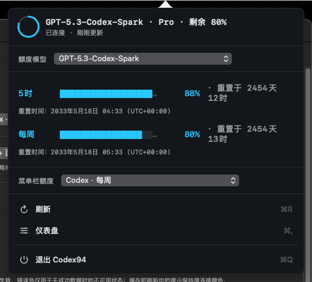
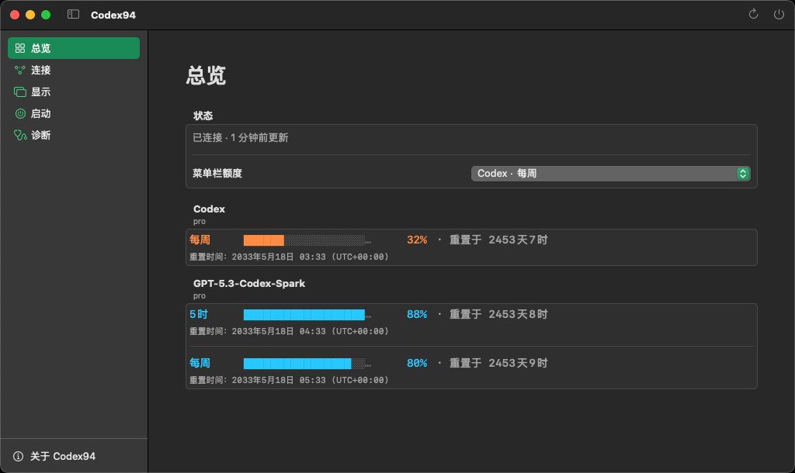
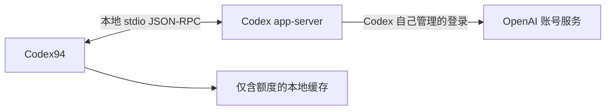

# Codex94

[English](README.md) | **简体中文**

## 产品简介

Codex94 是一款与 OpenAI Codex 兼容的非官方、独立 macOS 菜单栏额度监控工具。
菜单栏中的紧凑圆环会显示所选额度窗口的剩余百分比；点击后会展开 CLI 风格的
额度面板。App 不显示 Dock 图标，Dashboard 主要用于连接与显示设置。

Codex94 是采用 MIT 许可的源码项目，使用 Mac 上已有的 Codex 可执行文件，
并且没有第三方运行时依赖。

**本项目通过 Codex 辅助的 vibe coding 工作流构建。** 每个源码版本在创建标签前
仍会由维护者检查，并通过测试与安全扫描。

> Codex94 与 OpenAI 没有隶属关系，也未获得 OpenAI 的认可、背书或赞助。Codex
> `app-server` 是实验性接口，未来 Codex 版本可能会改变它。

## 界面截图

以下数值来自隔离的文档渲染夹具，仅用于展示，不包含真实账号、身份信息或额度。

<p align="center">
  
</p>
<p align="center"><strong>紧凑菜单栏状态</strong></p>

<p align="center">
  
</p>
<p align="center"><strong>CLI 风格额度面板</strong></p>

<p align="center">
  
</p>
<p align="center"><strong>连接设置页面</strong></p>

## 当前分发状态

- 当前稳定源码标签为 `v0.1.4`。
- 当仓库可见性设为 Public 后，任何人都可以在无需 GitHub 认证的情况下 clone 源码。
- 当前没有 GitHub Release、DMG、经过公证的二进制或自动更新功能。
- `script/install.sh` 会构建本地 Release App，应用 ad-hoc Hardened
  Runtime 签名，并安装到 `~/Applications/Codex94.app`。
- 再次运行安装脚本会原位覆盖这一个 App，不会为每个版本保留单独副本。

请勿把本地 ad-hoc 签名构建描述成可公开分发的已公证下载版本。

## 系统要求

- macOS 14 或更高版本。
- 完整版 Xcode 16.4 或更高版本；仅有 Command Line Tools 不够。
- 安装脚本的静态安全检查需要 `ripgrep`（`rg`）。
- 一个兼容的 Codex 可执行文件，以及用于读取实时额度的当前 Codex 登录状态。

Codex94 可以使用 ChatGPT App 内置的 Codex 可执行文件；只要该内置版本兼容，
就不需要额外安装独立 Codex CLI。它也可以检测 Homebrew 与常见 CLI 路径，
或使用用户手动选择的可执行文件。

## 从源码安装

仓库公开后，可使用以下命令安装稳定的 `v0.1.4` 源码：

```bash
brew install ripgrep
git clone --branch v0.1.4 --depth 1 https://github.com/DEFY-AN94/codex94.git
cd codex94

sudo xcodebuild -license accept
sudo xcodebuild -runFirstLaunch

./script/install.sh
```

安装脚本会构建、签名、安装并打开
`~/Applications/Codex94.app`。如需安装后不自动打开：

```bash
./script/install.sh --no-launch
```

首次启动时，可以选择允许 Codex94 请求 **额度 + 账号信息** 或 **仅额度**。
只有从上述稳定路径运行时，Dashboard 才允许启用登录时启动。

## 主要行为

- App 启动、每次展开菜单栏面板，以及按所选的 1、5、15 或 30 分钟间隔刷新。
- 使用 `account/rateLimits/read` 读取实时额度；在 **额度 + 账号信息** 模式下，
  还会调用 `account/read`，并固定使用 `refreshToken: false`。
- 显示剩余百分比；`自动` 会选择现有窗口中剩余比例最低的一项。
- Codex 未返回 5 小时窗口时，会隐藏该额度行与选择项；如果返回 Weekly 窗口，
  则继续显示每周额度。
- 刷新失败时保留最后一次成功数值，并标记为 stale。
- 点击面板以外区域会收起临时面板，不会吞掉原始点击，也不需要辅助功能权限。
- Codex 检测顺序为：手动路径、ChatGPT App 内置文件、Homebrew、
  `/usr/local/bin`、`~/.local/bin`，最后是 `PATH` 中的绝对路径。
- Dashboard 提供 900x600、1280x720、1440x810 和 1920x1080 逻辑点窗口预设；
  超出当前屏幕时会按比例适配。
- 支持跟随系统、Terminal Dark、Terminal Light 主题，以及 English 和简体中文。
- 只使用当前 Codex 登录；不管理多账号或其他 `CODEX_HOME` 目录。

## 安全与隐私



Codex94 使用固定参数启动已验证的可执行文件：

```text
codex -s read-only -a untrusted app-server --stdio
```

身份验证由 Codex 自己管理，Codex 可能会访问 OpenAI 服务。Codex94 不接收
access token 或 refresh token，不直接发送额度 HTTP 请求，也不读取认证文件、
浏览器 cookie、Keychain、Codex session 日志或 SQLite 数据库。

本地缓存仅保存额度窗口类型、百分比、重置时间、套餐类型和获取时间，并使用仅限
当前用户的文件权限。**额度 + 账号信息** 模式下的邮箱只存在于内存；切换为
**仅额度** 后会从内存快照移除。UserDefaults 保存界面选项和用户手动选择的
可执行文件路径。Codex94 没有分析、广告、遥测上传、崩溃上报 SDK、更新检查器
或项目自营服务器。

App Sandbox 被有意关闭，因为 Codex 子进程需要访问它自己的登录状态。
Hardened Runtime 仍然启用；子进程参数固定、环境变量最小化、输出有大小限制、
请求有超时，并且每次刷新后都会终止完整进程组。版本验证只检查协议兼容性，
不验证发布者身份，因此用户必须信任自己的 ChatGPT/Codex 安装以及手动选择的
可执行文件。

复制诊断时，Codex94 会先规范化可执行文件路径与版本，再将文本写入系统剪贴板。
分享前仍应由用户再次检查内容；Codex94 不会上传诊断信息。

完整边界请参阅 [PRIVACY.md](PRIVACY.md) 和 [SECURITY.md](SECURITY.md)
（英文）。

## 开发与构建

贡献与发布检查还需要 `jq`：

```bash
brew install ripgrep jq
```

构建并运行 Debug App：

```bash
./script/build_and_run.sh
```

运行静态安全检查、构建、启动并确认进程：

```bash
./script/build_and_run.sh --verify
```

运行单元测试与 fake app-server 集成测试：

```bash
DEVELOPER_DIR=/Applications/Xcode.app/Contents/Developer \
  xcodebuild -project Codex94.xcodeproj -scheme Codex94 \
  -destination 'platform=macOS' -derivedDataPath .build/DerivedData \
  CODE_SIGNING_ALLOWED=NO test
```

运行完整本地发布检查：

```bash
./script/release_check.sh
```

SwiftUI 负责视图与状态呈现；AppKit 负责菜单栏状态项、Popover、App 外观和
Dashboard 窗口生命周期。贡献与发布流程见
[CONTRIBUTING.md](CONTRIBUTING.md) 和
[docs/RELEASING.md](docs/RELEASING.md)（英文）。

## 卸载

先在 Dashboard 中关闭 **登录时启动**，然后退出 Codex94。再删除已安装 App、
本地缓存和偏好设置：

```bash
rm -rf "$HOME/Applications/Codex94.app"
rm -rf "$HOME/Library/Application Support/Codex94"
defaults delete com.defyan94.codex94
```

## 许可

Codex94 使用 [MIT License](LICENSE)。设计与实现参考见
[ATTRIBUTIONS.md](ATTRIBUTIONS.md)（英文）。

Codex 和 ChatGPT 是 OpenAI 的商标。Codex94 是独立的非官方项目，不使用
OpenAI Logo。
