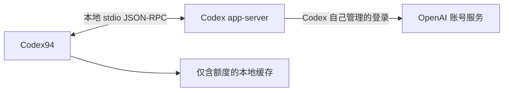

# Codex94

[English](README.md) | **简体中文**

## 产品简介

Codex94 是一款与 OpenAI Codex 兼容的非官方、独立 macOS 菜单栏额度监控工具。
菜单栏中的紧凑圆环会显示所选模型额度桶与额度窗口的剩余百分比；点击后会展开
CLI 风格的额度面板。App 不显示 Dock 图标，新建 Dashboard 窗口默认进入总览，集中
呈现所有可显示额度桶及服务实际返回的窗口，并提供连接与显示设置。

Codex94 是采用 MIT 许可的源码项目，使用 Mac 上已有的 Codex 可执行文件，
并且没有第三方运行时依赖。

**本项目通过 Codex 辅助的 vibe coding 工作流构建。** 每个源码版本在创建标签前
仍会由维护者检查，并通过测试与安全扫描。

> Codex94 与 OpenAI 没有隶属关系，也未获得 OpenAI 的认可、背书或赞助。Codex
> `app-server` 是实验性接口，未来 Codex 版本可能会改变它。

## 界面截图

以下数值来自隔离的文档渲染夹具，仅用于展示，不包含真实账号、身份信息或额度。
当前嵌入的 Popover 和 Dashboard 图片仍来自隔离 CI 中的 `0.1.8`，并已在纳入前
审查。图中固定的未来 Reset 日期是测试值，并非实时重置时间。Draft PR CI 才会
生成首张 `0.1.9` 总览产物；在替换本文图片前，仍需完成人工视觉与隐私审查。
未改变的默认菜单栏示例保留自 `v0.1.7`。

<p align="center">
  
</p>
<p align="center"><strong>紧凑菜单栏状态</strong></p>

<p align="center">
  
</p>
<p align="center"><strong>CLI 风格额度面板</strong></p>

<p align="center">
  
</p>
<p align="center"><strong>显示设置页面</strong></p>

## 当前分发状态

- 当前工作源码候选版本为 `0.1.9 (10)`；最新已发布稳定源码标签仍为 `v0.1.8`。
- `0.1.9` 只有在标签发布后才是源码发布；`main` 与功能分支可能包含未发布准备内容。
- 仓库已公开，任何人都可以在无需 GitHub 认证的情况下 clone 源码。
- 当前没有 GitHub Release、DMG、经过公证的二进制或自动更新功能。
- `script/install.sh` 会构建本地 Release App，应用 ad-hoc Hardened
  Runtime 签名，并安装到 `~/Applications/Codex94.app`。
- 再次运行安装脚本会原位覆盖这一个 App，不会为每个版本保留单独副本。

请勿把本地 ad-hoc 签名构建描述成可公开分发的已公证下载版本。

## 系统要求

- macOS 14 或更高版本。
- 完整版 Xcode 16.4 或更高版本；仅有 Command Line Tools 不够。
- 安装脚本的静态安全检查需要 `ripgrep`（`rg`）。
- 一个兼容的 Codex 可执行文件，以及用于读取实时额度的当前 Codex 登录状态。

Codex94 可以使用 ChatGPT App 内置的 Codex 可执行文件；只要该内置版本兼容，
就不需要额外安装独立 Codex CLI。它也可以检测 Homebrew 与常见 CLI 路径，
或使用用户手动选择的可执行文件。

## 从源码安装

可使用以下命令安装当前稳定的 `v0.1.8` 源码：

```bash
brew install ripgrep
git clone --branch v0.1.8 --depth 1 https://github.com/DEFY-AN94/codex94.git
cd codex94

sudo xcodebuild -license accept
sudo xcodebuild -runFirstLaunch

./script/install.sh
```

安装脚本会构建、签名、安装并打开
`~/Applications/Codex94.app`。如需安装后不自动打开：

```bash
./script/install.sh --no-launch
```

首次启动时，可以选择允许 Codex94 请求 **额度 + 账号信息** 或 **仅额度**。
只有从上述稳定路径运行时，Dashboard 才允许启用登录时启动。

## 主要行为

- 新建 Dashboard 窗口默认打开**总览**，复用当前连接状态、数据新鲜度文案和菜单栏
  额度选择器，再按既有显示顺序展示所有可显示额度桶，以及服务实际返回的 5 小时或 Weekly
  窗口。缺失数据会显示明确空状态，不伪造 `0%`。打开、浏览或滚动总览不会刷新或
  写额度缓存；页面不显示邮箱、可执行文件路径或原始额度桶标识，刷新仍使用
  Dashboard 现有工具栏入口。
- 在 Dashboard → 显示中选择**圆环 + 百分比**、**仅百分比**或
  **仅圆环**。正在运行的菜单栏状态项会立即改变布局与宽度，并且不会被删除或
  重建；状态标记位于圆环中央，或在“仅百分比”模式下占用固定尾部位置。
- 分别自定义充足（50–100%）、偏低（20–49%）、紧张（0–19%）
  和无可用数据时连接不可用的四种颜色；阈值不可调整。颜色即时生效，按不透明
  sRGB 的规范化六位大写 `RRGGBB` 保存，不含透明度。紧张色和错误色彼此独立，
  即使两者默认都是主题红色也不会联动。**恢复默认颜色**只移除这四项覆盖，
  不改变布局、主题、语言、额度选择、可执行文件路径或窗口尺寸。
- 额度行下方独立显示绝对**重置时间**，包含完整日期、小时/分钟及
  重置时刻的 UTC 偏移，正确区分夏令时。原倒计时保留；没有日期则显示不可用，
  过去日期仍显示原时间，倒计时不低于零。日期遵循 App 语言的 locale 和当前时区。
  Dashboard → 连接显示菜单栏实际解析的额度桶与窗口（包括暂时回退到自动的结果），
  而不是 Popover 中单独浏览的模型。
- 错误横幅提供**打开连接设置**或**打开诊断**，复用同一个 Dashboard
  窗口；普通打开 Dashboard 会保留当前页面。这些按钮只负责导航，重试仍使用
  原有**刷新**。未登录时会提示先在 Codex 中登录、再回来刷新；Codex94 不代为登录。
- 修改布局/颜色、呈现总览、渲染重置时间文案以及恢复导航本身不会请求额度、写入
  额度缓存或改变连接状态；打开 Popover 和独立的 post-reset 调度仍按下述行为刷新。
- App 启动、每次展开菜单栏面板，以及按所选的 1、5、15 或 30 分钟间隔刷新。
- Mac 唤醒后，如果没有成功快照，或上次成功已过去至少 60 秒，则刷新一次；
  更鲜的快照保持不变。唤醒、后台、手动和展开面板触发的请求共用同一条单飞
  刷新路径。
- 每次成功快照后，会从所有可显示窗口中选择最早的未来 Reset，仅在
  `resetsAt + 5` 秒或更晚安排一次内存中的刷新。相同目标会去重，相邻请求复用同一
  单飞路径，已消费目标不会进行 Reset 专属重试。唤醒与系统时钟变化会重新协调这项
  一次性计划；不新增持久化 Reset 账本或后台刷新周期。
- 使用 `account/rateLimits/read` 读取实时额度；在 **额度 + 账号信息** 模式下，
  还会调用 `account/read`，并固定使用 `refreshToken: false`。
- 将 Codex 返回的标准/默认额度桶与额外命名的模型额度桶分开处理。默认额度桶显示
  为 **Codex**；其他额度桶使用服务端提供的名称，例如 **Spark**。
- Popover 中的模型选择器每次浏览一个额度桶，与菜单栏选择相互独立；浏览模型
  不会改变菜单栏圆环。
- 动态的菜单栏额度菜单提供 `自动` 以及每个可用额度桶与窗口；`自动` 会在所有
  可显示额度桶和窗口中选择剩余比例最低的一项。
- Codex 未返回某个 5 小时或 Weekly 窗口时，会隐藏对应额度行与选择项；App
  不估算额度，也不会合并彼此独立的额度窗口。
- 将额度严重度与连接/数据新鲜度分开：额度圆环、百分比和进度条使用同一套解析后
  的充足/偏低/紧张颜色，默认依次为绿色、琥珀色和红色。刷新中与缓存标记保持
  蓝色/青色连接强调色。在没有可用数据且连接不可用时，标记、横幅和
  Dashboard 错误状态点使用独立错误色，默认取应用紧张色覆盖前的主题红色。
- 刷新失败时保留最后一次成功的额度并标记为缓存数据；没有可用额度快照时显示
  灰色 `--`，不会伪装成 `0%`。
- Popover 标题区域会显示最后一次成功额度数据的相对时间。已有快照时刷新会明确
  显示“上次成功”，刷新中或不可用且没有快照时则使用不同的“暂无成功数据”语义；
  菜单栏和 Popover 的辅助功能描述也包含相同的新鲜度信息。
- 点击面板以外区域会收起临时面板，不会吞掉原始点击，也不需要辅助功能权限。
- Codex 检测顺序为：手动路径、ChatGPT App 内置文件、Homebrew、
  `/usr/local/bin`、`~/.local/bin`，最后是 `PATH` 中的绝对路径。
- Dashboard 提供 900x600、1280x720、1440x810 和 1920x1080 逻辑点窗口预设；
  超出当前屏幕时会按比例适配。
- Dashboard → 关于显示精确候选值 `0.1.9 (10)`，由用户触发的复制结果与之完全一致；
  项目链接指向 `https://github.com/DEFY-AN94/codex94`，不会增加更新器或网络客户端。
- 支持跟随系统、Terminal Dark、Terminal Light 主题，以及 English 和简体中文。
- 只使用当前 Codex 登录；不管理多账号或其他 `CODEX_HOME` 目录。

## 安全与隐私



Codex94 使用固定参数启动已验证的可执行文件：

```text
codex -s read-only -a never app-server --stdio
```

身份验证由 Codex 自己管理，Codex 可能会访问 OpenAI 服务。Codex94 不实现
OAuth，不接收 access token 或 refresh token，不直接发送额度 HTTP 请求，也不
读取认证文件、浏览器 cookie、Keychain、Codex session 日志或 SQLite 数据库。

带版本的本地缓存仅保存额度桶标识与可选名称、套餐类型、窗口时长与类型、百分比、
重置时间和获取时间，并使用仅限当前用户的文件权限。**额度 + 账号信息** 模式下
的邮箱只存在于内存；切换为 **仅额度** 后会从内存快照移除。UserDefaults 保存
界面选项（包括菜单栏额度偏好）和用户手动选择的可执行文件路径。版本 0.1.8 引入
`menuBarLayout.v1` 与 `statusAccentOverrides.v1`，分别保存布局和四种颜色覆盖；
0.1.9 保持这些 key 与迁移不变，并让布局即时生效。重置时间文案和内存中的
post-reset 调度只使用现有重置时间戳，不新增缓存字段或持久化账本。总览复用现有
快照，不存储新的身份数据。Popover 中浏览的模型和 Dashboard 当前页面只在本次
运行中保存；窗口 frame autosave 行为保持不变。
Codex94 没有分析、广告、遥测上传、崩溃上报 SDK、
更新检查器或项目自营服务器。

App Sandbox 被有意关闭，因为 Codex 子进程需要访问它自己的登录状态。
Hardened Runtime 仍然启用；子进程参数固定、环境变量最小化、输出有大小限制、
请求有超时，并且每次刷新后或 App 退出时都会在有界时间内终止并回收完整进程组。
版本验证只检查协议兼容性，不验证发布者身份，因此用户必须信任自己的
ChatGPT/Codex 安装以及手动选择的可执行文件。

诊断与关于页面的复制按钮只会在用户操作后写入剪贴板。复制诊断时，Codex94 会先
规范化可执行文件路径与版本；关于页面复制与显示完全一致的版本和 build。分享诊断
前仍应由用户再次检查内容；Codex94 不读取或上传剪贴板内容及诊断信息。

完整边界请参阅 [PRIVACY.md](PRIVACY.md) 和 [SECURITY.md](SECURITY.md)
（英文）。

## 开发与构建

贡献与发布检查还需要 `jq`：

```bash
brew install ripgrep jq
```

构建并运行 Debug App：

```bash
./script/build_and_run.sh
```

`build_and_run.sh` 会在构建前关闭现有的匹配名称 Codex94 进程，然后启动 Debug
App。`install.sh` 会替换安装路径中的 App，并可能启动它。这些脚本并非只读检查；
本机运行的 App 可能使用与已安装 App 相同的偏好和缓存。

自动测试和文档截图应使用合成数据、注入 fetcher 或显式指定的 fake executable。
不要在共享夹具或产物中包含真实账号凭证、身份、额度或私人路径。测试偏好与缓存
应与日常 App 数据分开；详见 [CONTRIBUTING.md](CONTRIBUTING.md)（英文）。

运行单元测试与 fake app-server 集成测试：

```bash
DEVELOPER_DIR=/Applications/Xcode.app/Contents/Developer \
  xcodebuild -project Codex94.xcodeproj -scheme Codex94 \
  -destination 'platform=macOS' -derivedDataPath .build/DerivedData \
  CODE_SIGNING_ALLOWED=NO test
```

运行完整发布检查，包括 hosted tests、Release 构建和安全/签名检查：

```bash
./script/release_check.sh
```

版本 0.1.8 已通过完整 GitHub 测试/发布任务、合成 Display 与点击功能 Recovery UI
任务，以及 Actions/Swift CodeQL。独立的合成 A/B GUI smoke 覆盖三种下次启动布局、
颜色恢复、绝对 Reset 文案、hard-unavailable 恢复和手动刷新。四张
Popover/Dashboard 截图已完成视觉和隐私审查。键盘激活、AXPress 与托管运行器
tooltip 暴露不声明为已通过。
Draft PR CI、exact-head GUI 证据和首张 `0.1.9` 总览产物仍处于待完成状态，本文不把
它们描述为发布证据。

SwiftUI 负责视图与状态呈现；AppKit 负责菜单栏状态项、Popover、App 外观和
Dashboard 窗口生命周期。贡献与发布流程见 [CONTRIBUTING.md](CONTRIBUTING.md) 和
[docs/RELEASING.md](docs/RELEASING.md)（英文）。

## 卸载

先在 Dashboard 中关闭 **登录时启动**，然后退出 Codex94。再删除已安装 App、
本地缓存和偏好设置：

```bash
rm -rf "$HOME/Applications/Codex94.app"
rm -rf "$HOME/Library/Application Support/Codex94"
defaults delete com.defyan94.codex94
```

## 许可

Codex94 使用 [MIT License](LICENSE)。设计与实现参考见
[ATTRIBUTIONS.md](ATTRIBUTIONS.md)（英文）。

Codex 和 ChatGPT 是 OpenAI 的商标。Codex94 是独立的非官方项目，不使用
OpenAI Logo。
