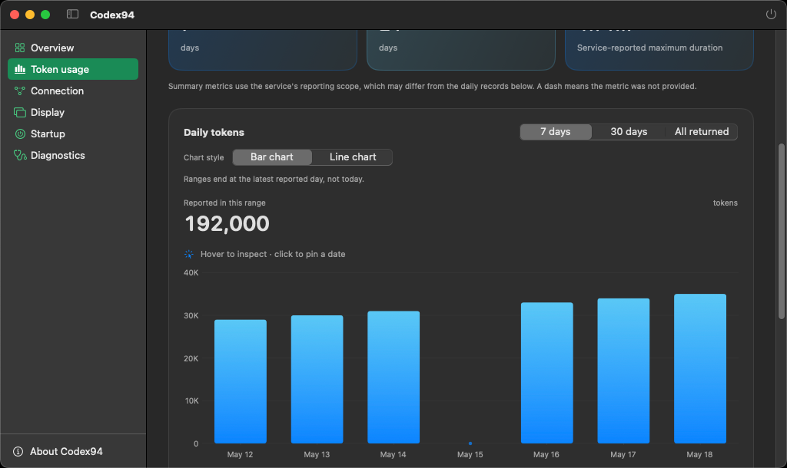
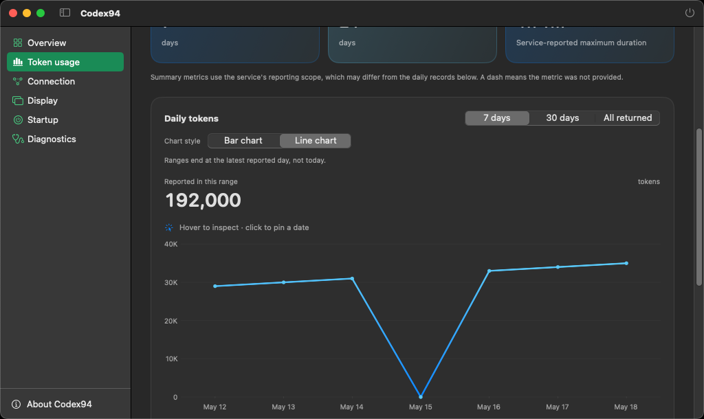
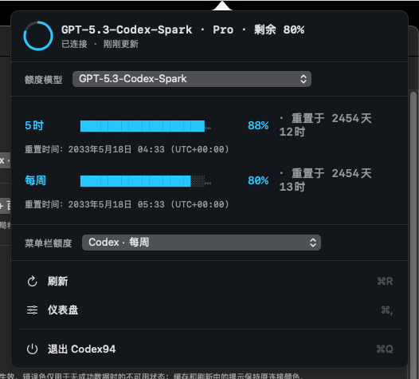
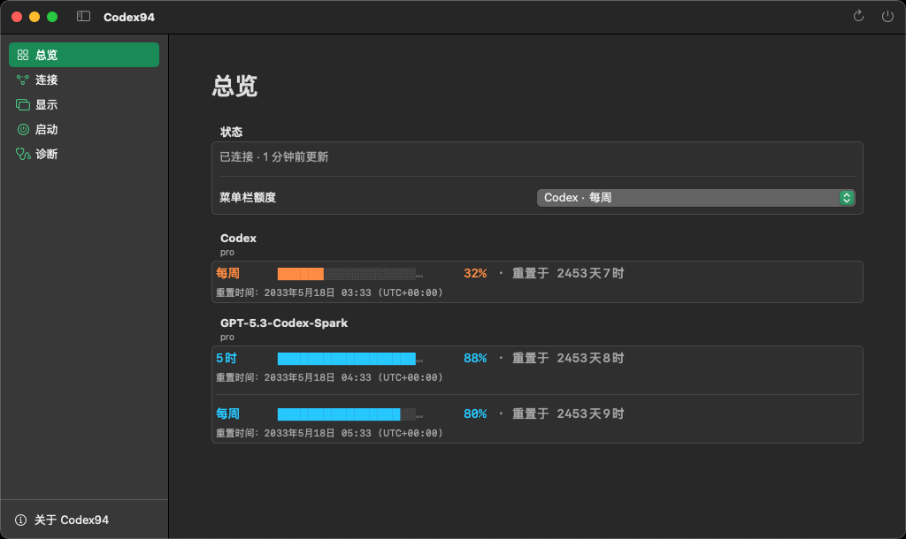
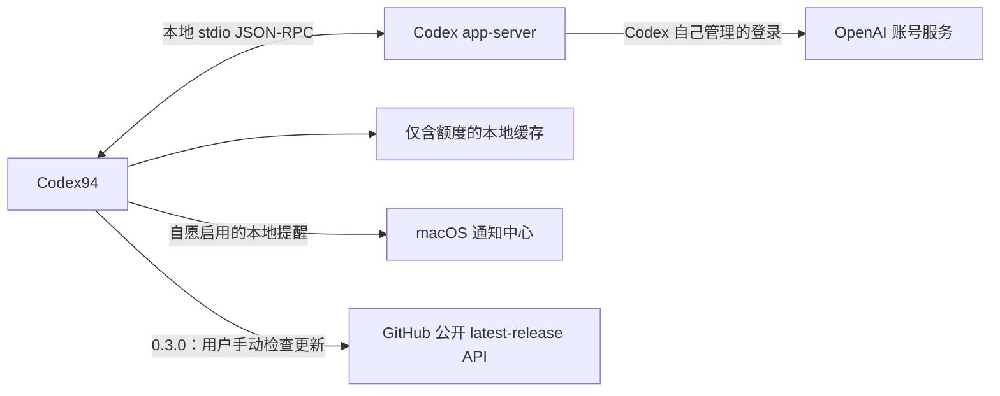

# Codex94

[English](README.md) | **简体中文**

## 产品简介

Codex94 是一款非官方、独立的 macOS **Codex 与 Claude Code 额度监控**工具，
同时提供 **Codex Token 统计**。默认开启 Codex；Claude 可选启用，默认读取本地
被动报告。菜单栏展示剩余额度和重置时间，不占用 Dock；同一弹出面板和 Dashboard
提供详细信息。

`0.3.0 (14)` 新增 Codex 服务端汇总卡、可切换的**柱状图／折线图**，以及每日 Token 记录的
**CSV 导出**。手动检查更新可查看 GitHub 上更新的稳定 Release，下载和安装仍由用户完成。

`0.2.2 (13)` 引入的额度功能继续保留：四种菜单栏布局（含双窗口）、可选的低额度／
恢复提醒和可配置全局快捷键。鼠标左键或右键都切换同一个面板。面板和总览中的只读
**手动额度重置**区域展示可用次数，不执行重置兑换。

Codex94 是采用 MIT 许可的源码项目。Codex 监控使用本机安装的 Codex CLI；
Claude 默认仅读取已有的本地状态栏报告，不捆绑第三方运行时框架。

**本项目通过 Codex 辅助的 vibe coding 工作流构建。** 每个版本在创建标签前
仍会由维护者检查，并通过测试与安全扫描。

> Codex94 与 OpenAI 或 Anthropic 没有隶属关系，也未获得两者的认可、背书或赞助。
> Codex `app-server` 是实验性接口；上游更新也可能改变 CLI 和状态栏的数据格式。

## 4.1.0 候选版（尚未发布）

当前开发版本为 **4.1.0 (24)**，分支为 `claude/4.1.0-local-usage-cache`。新版本正式发布
确认前，下方稳定下载继续指向 4.0.1。`4.0.2 (23)` 候选版（通知回调修复、独立大额度卡片、
紧凑双圈以及状态栏适用范围说明）已具备合并条件，但从未打标签或发布；4.1.0 原样带入这些改动。

4.1.0 只改动 Claude 侧，Codex 行为保持不变。

- **Claude Code 的本地用量缓存成为主来源。** Claude Code 会把自己获取套餐用量的结果
  （也就是其 `/usage` 页面背后的数据）写入全局状态文件 `~/.claude.json` 的
  `cachedUsageUtilization` 键；Claude Code 2.1.208 及之后版本会保留这份“最近已知用量”。
  Codex94 只读取这一个键，展示 5 小时与 7 天用量、各自的重置时间，以及 Claude Code
  取数的时间。若 Codex94 自身环境中设置了 `CLAUDE_CONFIG_DIR`，则改从该目录读取，
  与 Claude Code 行为一致。
- **三层来源，每次只显示一份报告。** 既有状态栏连接改为备援：仅当其报告严格新于缓存，
  或缓存不存在／无法读取时使用。可选的 CLI `/usage` 读取仍默认关闭并保留额度消耗提示，
  改为最后选项；它不再与被动来源互斥，结果只是加入选择，关闭时仅丢弃 CLI 数据。
  最新的有效报告胜出，时间相同时缓存优先。不同来源的百分比绝不取平均或合并。
  同一账号的各层来源共用一个通知基线；只有换了登录账号、换了状态栏来源或 CLI 登录被拒绝时才会重置。
- **用 CLI 刷新一次。** Dashboard → **服务**新增一个按钮，无论 CLI 开关如何都只运行一次
  官方 CLI，并显示同样的提示。随后 Claude Code 会刷新自己的缓存，再由主来源读取。
- **按模型周限额。** 缓存中按模型划分的周限额（例如 Fable 的周限额）作为额外的 Claude
  额度桶出现：在卡片的**按模型周限额**下列出，可在菜单栏额度选择器中选择，也参与自动
  “最紧张”选择。
- **新鲜度与呈现。** 缓存报告在 Claude Code 取数后 60 分钟内视为当前数据，与 Claude Code
  自己的“最近已知”规则一致；超时后显示琥珀色缓存标记和数据时间，数值仍然可见。
  状态栏报告沿用既有的 10 分钟规则；CLI 读取取 10 分钟与“刷新间隔加 60 秒”中的较大值。
  重置时间已过的窗口会消失，绝不显示为剩余 100%。卡片标明来源（**Claude Code 本地缓存**），
  显示 **Claude Code 取数时间**，并为尚无缓存（在终端运行 `claude` 并输入 `/usage`，
  或使用一次性 CLI 读取）、缓存无法读取和窗口已到期提供明确空状态。服务页新增只读的
  **Claude 数据来源**区域，说明三层来源并显示当前来源与本地缓存状态。诊断导出新增
  `claudeLocalCache` 一行（absent／valid／unreadable／invalid；关闭 Claude 监控时为 none），
  不含路径或账号标识。

**隐私边界。** `~/.claude.json` 还包含账号邮箱、组织、项目路径和 MCP 设置。Codex94 以只读
方式并带 `O_NOFOLLOW` 打开它，拒绝符号链接、硬链接文件、非当前用户所有、非常规文件以及超过 16 MiB 的文件，
只解析 `cachedUsageUtilization`，其余内容立即丢弃；除上述额度字段外，文件中的任何内容都不会
被保留、记录或导出。账号 UUID 仅在内存中比较，用于识别换了登录账号（这会重置通知基线），
从不持久化。读取器从不写入该文件，仅在其大小、修改时间或 inode 变化时重新解析。偏好 key
保持不变（`claude.cliUsageEnabled.v1` 含义不变）；不新增偏好、缓存文件、entitlement、
网络端点或安装步骤。

**不接入 OAuth，也不读取凭据。** [Anthropic 的法律页面](https://code.claude.com/docs/en/legal-and-compliance#authentication-and-credential-use)
（2026-02-20）将 OAuth 令牌限定于 Claude Code 和 Anthropic 原生应用，并禁止第三方收集、
存储或中转 Claude.ai 凭据或会话令牌。因此 Codex94 只读取官方客户端留在本机上的文件。
`AppUpdateClient.swift` 仍是唯一的网络客户端；没有新增 HTTP／OAuth 客户端，也不读取
Keychain、cookie 或令牌。`script/security_check.sh` 另外禁止生产源码中出现凭据文件名、
Claude Code 的 Keychain 条目名、`SecItem`／`SecKeychain` 调用及 OAuth 用量端点字符串，
并只允许缓存读取器出现 `claude.json` 字面量。暂停的 OAuth 工作位于草稿
[PR #44](https://github.com/DEFY-AN94/codex94/pull/44)，不属于 4.1.0。

目前 App target 与 UI 测试包均已在本机 Xcode 27.0 上构建通过，托管单元测试套件也已在本机通过：
执行 544 项，1 项既有托管焦点跳过，0 失败；元数据、安装器与安全扫描脚本的自测同样通过；
`script/release_check.sh` 也已在本机 Xcode 27.0 上针对 `4.1.0 (24)` 通过，验证了 Universal App
与未签名 DMG 候选（仅为本机产物，不是发布资产）。CI（Xcode 16.4）上首个 PR 头的 `test` 任务
与 display、floating、recovery、usage 四个 UI 烟雾场景通过；providers 场景两次因测试侧原因失败
并已修正（先是早于“缓存数据”前缀的精确文本断言，再是夹具中 Fable 模型限额成为最紧窗口而改变了
原生状态项的标签），其重跑、候选验收、标签、CI 产出的 DMG 和发布均为待完成。
UI 烟雾场景已加入夹具：通过
`CLAUDE_CONFIG_DIR` 注入合成的 `.claude.json`，并检查关闭 CLI 选项后显示缓存来源且不启动
CLI；它只有在实际运行后才算证据。下方历史截图与验证结果不代表 4.1.0 已通过验收。

## 4.0.1 版本

`4.0.1 (22)` 已于 **2026-10-03**（Australia/Melbourne）正式发布，现为稳定版。
本版保留未公开 4.0.0 候选版的双服务功能；`v4.0.0` 标签原样保留，其 Draft Release
已移除，下方该候选版的验证结果继续作为历史证据保留。

Claude **默认读取本地状态栏的被动报告**。根据
[Anthropic 的凭据使用规则](https://code.claude.com/docs/en/legal-and-compliance#authentication-and-credential-use)，
目前未满足第三方复用订阅 OAuth 凭据的授权前提，因此不接入 OAuth，不读取令牌、不刷新凭据，
也不增加 Claude HTTP 客户端。`/usage` 实测继续暂停；它保留为独立、默认关闭的选项，
并明确提示额度消耗风险。

被动报告来自你正常使用 Claude Code 的过程；Codex94 不会为获得报告启动会话或发送提示。
仅登录 Claude App 或网页不会产生 Code 状态栏报告。额度字段需要该 Code 会话先收到
API 响应，详见[官方状态栏说明](https://code.claude.com/docs/en/statusline#available-data)。
官方状态栏数据不含可核验的账号 ID，所以显示“账号未验证”，CLI 模式也不会自动采用它作为
回退。报告来自另一个会话时，需要明确选择采用；会话指纹仅区分报告流，不能证明账号一致。
重复报告保留原本地报告时间，窗口到期后显示未知，不推算恢复为 100%。

- **默认只开启 Codex，Claude 关闭。** 可在 Dashboard → **服务**中启用 Claude。
  各服务分别维护刷新任务、额度选择、数据来源、新鲜度、错误和自愿开启的通知设置；
  一方失败不会替换另一方的额度。
- 菜单栏可显示**单个服务**或**两个独立状态项**。点击任一项都会打开同一个可滚动
  面板，按独立区块展示全部已启用服务；总览也显示这些服务。Codex 的额度组选项、
  账号模式和只读重置次数继续保留。
- 悬浮窗可独立选择服务，不必跟随主要菜单栏服务。关闭某服务会停止其监控和提醒；
  两者均关闭时保留中性状态项，仍可进入服务设置。
- Claude 额度可来自**状态栏连接**；只有单独开启 CLI 选项后才会使用官方 CLI 的
  **`/usage` 页面**。卡片明确
  标注来源与报告时间，保留服务报告的小数精度；缺失额度或重置时间保持未知，
  不把 Codex 和 Claude 的百分比合并计算。
- 状态栏报告是 Claude Code 在本地产生的信息，不代表一次新的云端额度采样；
  重读未变化的报告不会把报告时间刷新为现在。服务设置可预览并安装保留原有状态栏
  命令的 wrapper；移除时仅在配置仍匹配的情况下恢复原命令。关闭监控会停止额度
  捕获，但不会卸载连接，移除连接是单独的操作。
- **Token 统计、图表、CSV／PNG 导出和图表复制仍仅支持 Codex。** 关闭 Codex
  监控后，该页面不再读取数据；本次没有加入 Claude Token／费用分析。

## 先前的 3.1.4 版本

`3.1.4 (20)` 于 **2026-09-28**（Australia/Melbourne）发布。该版为 Codex
额度读取提供更充足的等待时间，并在短暂失败后分别等待 5、20、60 秒重试；
这些功能继续保留。
重试间隔内继续显示最后成功的额度、琥珀色缓存标记和失败原因；下一次计划时间已知时，
Popover、连接页及菜单栏提示会显示自动尝试时刻。对应
[issue #36](https://github.com/DEFY-AN94/codex94/issues/36) 和[修复 PR](https://github.com/DEFY-AN94/codex94/pull/37)。

### 先前的 3.1.3 版本

`3.1.3 (19)` 已于 **2026-09-28**（Australia/Melbourne）正式发布。
本版先读取额度，再读取可降级的账号资料，避免较慢的身份请求丢弃有效额度；额度请求
短暂失败时采用有界重试。连接正常且数据不足 60 秒时，重新打开面板复用已有快照。
缓存状态改用独立琥珀色时钟，刷新中仍为蓝色。菜单栏彩色内容由透明、sRGB、非模板的
原生按钮图片绘制，提示文本也包含数据新鲜度。对应
[issue #33](https://github.com/DEFY-AN94/codex94/issues/33) 和
[修复 PR #34](https://github.com/DEFY-AN94/codex94/pull/34)。

维护者已确认：在本次测试的 Mac 上，使用精确的已审阅 CI 候选应用切换 Spaces 时，
所报告的菜单栏闪色问题已解决。此验收不扩展为所有 macOS、全屏配置或键盘路径均已
验证；候选身份与验收范围记录在[发布记录](docs/RELEASING.md)中。

`3.1.2 (18)` 引入的内置 CLI 兼容修复继续保留，包括已知 ChatGPT/Codex App 路径的
自动发现、旧路径回退与显式手动路径优先级；原始记录仍为
[issue #30](https://github.com/DEFY-AN94/codex94/issues/30) 和
[PR #31](https://github.com/DEFY-AN94/codex94/pull/31)。

## 主要功能

上述服务控制建立在以下既有 Codex 与显示功能之上。

- 额度横浮条在仅周额度或尚无数据时目标尺寸为 **480 × 90 逻辑点**，有真实
  5 小时窗口时为 **680 × 90**；支持置顶、拖动、隐藏和展开。
  复用已有额度数据；悬停或聚焦更新时间控件时显示手动刷新。不会新增轮询或兑换
  重置次数，原全局快捷键继续切换 Popover。
- Token 统计在原三个范围之外增加**自选日期**，沿用服务端日历日期标签。展示已报告
  日均值、所选区间峰值和覆盖率，与服务端汇总卡保持区分。对比前一等长区间时展示
  其已报告合计与覆盖天数；仅两段数据完整且基期非零时计算增长百分比。
- **导出 PNG…**与**复制图表图片**使用当前范围、柱状／折线样式、语言和主题；
  图片仅含图表、日期范围、抓取时间、覆盖和旧数据说明，不含身份。复制只在用户
  点击后写入系统剪贴板，CSV 导出继续保留。
- 浮条偏好保存置顶状态与位置，4.0 另存服务选择；自适应宽度仍由额度数据推导。
  App 不保存统计历史库，分发签名和手动安装方式保持不变。

验证包含第四个合成 **Floating** UI 场景及统计控件／图片检查，证据分类见下文。
原生键盘焦点、浮窗跨 Spaces 与全屏应用行为仍须分别实测，不能仅凭图片或面板配置
认定；先前 3.1.3 的菜单栏闪色验收仅对应当时测试的 Mac 与精确候选应用。

## 界面截图

所有截图均采用隔离的合成数据，不包含真实账号或实时用量，也不代表 4.1.0 候选版的新布局。
以下**柱状图**与**折线图**采集于 `0.3.0 (14)` 候选测试阶段，使用相同的七天日记录。
原始合成截图保持不变，
这些英文界面截图来自
[CI run 35521556558](https://github.com/DEFY-AN94/codex94/actions/runs/35521556558)，
未编辑媒体内容。统计日期固定在 **2033 年**；5 月 15 日的零是夹具明确返回的数值，
不是为缺失日期补零。

<p align="center">
  <a href="docs/images/readme/token-usage-bar-0.3.0-en.png"></a>
  <a href="docs/images/readme/token-usage-line-0.3.0-en.png"></a>
</p>
<p align="center"><strong>Token 统计：自由切换柱状图与折线图</strong></p>

[查看简体中文汇总卡截图](docs/images/readme/token-usage-overview-0.3.0-zh-Hans.png)，
或查看[精确的截图来源记录](docs/images/readme/PROVENANCE.md)。

<details>
<summary>既有额度界面——历史版本截图</summary>

保留的菜单栏示例来自 `v0.1.7`，Popover 图片来自 `0.1.8`，Dashboard 总览图片来自
`0.1.9` 的 GitHub-hosted CI。图中固定的未来 Reset 日期均为合成测试值。原文件保持
不变，只展示各自版本的界面，不代表 `0.2.2` 新增功能或 `0.3.0` 的统计与更新界面。

<p align="center">
  
</p>
<p align="center"><strong>紧凑菜单栏状态</strong></p>

<p align="center">
  
</p>
<p align="center"><strong>CLI 风格额度面板</strong></p>

<p align="center">
  
</p>
<p align="center"><strong>额度总览</strong></p>

</details>

## 当前分发状态

- 已发布的稳定版为
  [`v4.0.1 (22)`](https://github.com/DEFY-AN94/codex94/releases/tag/v4.0.1)，
  于 **2026-10-03**（Australia/Melbourne）发布，提供 Universal 2 DMG 与来自同一个
  annotated 标签的源码。
- 下方下载和源码 clone 指令均指向该正式版本。后续文档提交不会移动其标签，
  也不会重新生成已发布的资产。
- `3.0.1 (15)` 是维护版本，修正请求上下文处理，并局部复用解析、图表准备和
  清理逻辑；保留 `0.3.0` 引入的功能，不包含大范围架构重写。
- 仓库已公开，无需 GitHub 认证即可 clone。
- `0.2.2` 没有检查更新入口，其用户需手动安装 `0.3.0` 或之后的正式版本才能获得该入口；
  后续更新的下载与安装仍由用户手动完成。
- `script/install.sh` 构建本地 Release App，应用 ad-hoc Hardened Runtime
  签名，并安装到 `~/Applications/Codex94.app`。
- 安装脚本要求先退出所有 Codex94 副本，使用安装锁并验证独立的暂存副本，
  替换成功前保留旧 App 以便回滚。回滚失败时保留恢复文件，但不维护各版本归档。

已发布的 `4.0.1` DMG 外层本身完全未签名，没有 Apple Developer ID 签名，也未经过 Apple
公证。其中的 `Codex94.app` 只有 ad-hoc 签名。SHA-256 与 GitHub artifact
attestation 都不会改变这一 Apple 信任状态。

## 系统要求

- macOS 14 或更高版本。
- Codex 监控需要兼容的 Codex 可执行文件和当前登录状态。
- 可选 Claude 监控只需要本机已登录的 Claude Code 至少获取过一次用量（例如在终端中
  打开 `/usage`），或已安装状态栏连接。Codex94 不代为完成 Claude 登录或首次引导；
  缓存和连接都不会凭空生成 Claude Code 未获取或未报告的数据。CLI `/usage` 选项仍为
  可选且默认关闭。

使用 DMG 安装不需要 Xcode。源码安装还需要完整版 Xcode 16.4 或更高版本
（仅有 Command Line Tools 不够），以及安装脚本静态安全检查使用的
`ripgrep`（`rg`）。

Codex94 可以使用 `/Applications/ChatGPT.app` 或 `/Applications/Codex.app`
中的兼容 Codex CLI，无需另装独立 CLI。它先检查新版
`Contents/Resources/codex-cli/CodexCLI.app/Contents/MacOS/codex` 路径，再检查旧
`Contents/Resources/codex` 路径，并保留 Homebrew 与常见 CLI 位置回退。显式手动
路径仍有最高优先级；无效的手动选择不会被悄悄绕过。

## 安装 Universal DMG

请从 [`v4.0.1` Release 页面](https://github.com/DEFY-AN94/codex94/releases/tag/v4.0.1)
下载以下两个正式资产：

- `Codex94-4.0.1-macos-universal-unnotarized.dmg`
- `Codex94-4.0.1-SHA256SUMS.txt`

DMG 支持 Apple Silicon（`arm64`）与 Intel（`x86_64`），最低系统为 macOS 14。
打开前先验证 checksum：

```bash
shasum -a 256 -c Codex94-4.0.1-SHA256SUMS.txt
```

如已安装 GitHub CLI，还可验证该 DMG 来自本仓库的 GitHub workflow 与提交：

```bash
gh attestation verify Codex94-4.0.1-macos-universal-unnotarized.dmg -R DEFY-AN94/codex94
```

Attestation 只证明构建来源，不代表 Apple 签名、公证、恶意软件审查或 Gatekeeper 认可。

先退出所有正在运行的 Codex94，再打开 DMG，把 `Codex94.app` 拖到其中的
`Applications` 快捷方式，安装位置是 `/Applications/Codex94.app`。不要同时运行
这里的副本和 `~/Applications` 中的副本；两者共用同一个 bundle identifier、
偏好、缓存与登录项注册。

由于此技术用户 DMG 未签名且未公证，macOS 可能阻止打开 DMG 或首次启动 App。
若你信任已经精确核验的该版本，请遵循 Apple 官方的
[“隐私与安全性 → 仍要打开”](https://support.apple.com/guide/mac-help/open-a-mac-app-from-an-unknown-developer-mh40616/26/mac/26)
流程。不要删除 quarantine 属性，也不要关闭 Gatekeeper。

## 从源码安装

Clone 当前已发布的稳定源码标签：

```bash
git clone --branch v4.0.1 --depth 1 https://github.com/DEFY-AN94/codex94.git
```

然后构建所选标签：

```bash
cd codex94
brew install ripgrep

sudo xcodebuild -license accept
sudo xcodebuild -runFirstLaunch

./script/install.sh
```

安装前请先退出所有 Codex94 副本。安装脚本会构建、签名、安装并打开
`~/Applications/Codex94.app`。如需安装后不自动打开：

```bash
./script/install.sh --no-launch
```

首次启动时，可以选择允许 Codex94 请求 **额度 + 账号信息** 或 **仅额度**。
登录时启动精确接受 `/Applications/Codex94.app` 与
`~/Applications/Codex94.app` 两个稳定位置。源码安装脚本不会迁移或删除 DMG
安装的副本。

## 主要行为

### Token 统计与手动检查更新

- Dashboard → **Token 统计**在首次进入或手动刷新统计时，通过
  `account/usage/read` 加载服务端数据，与额度轮询独立。统计读取失败不会让
  正常工作的菜单栏额度变成连接错误。
- 汇总卡展示返回的累计 Token、单日 Token 峰值、当前和最长连续使用天数、
  最长单次运行时长；未提供的数值保持未知。服务端汇总可能与日记录覆盖范围不同，
  不推测按模型、项目、输入／输出、费用或小时划分的数据。
- 可自由切换**柱状图／折线图**并记住选择；选中日期的虚线对齐柱体中心或折线数据点，
  折线在未返回数据的日期处断开。
- 每日图表与明细表提供 **7 天／30 天／全部返回／自选日期**。三个预设范围截至最新
  返回统计日，不代表截至今天；自选范围包含所选起止日。图中保留真实日期缺口，
  缺失日期不按零用量处理。悬停或点击可
  查看精确数值。服务端分日时区与完整历史覆盖范围尚无说明。
- **导出 CSV…**仅把当前范围内已返回的日记录保存到用户选择的文件，保留原始
  服务端日期和精确 Token 数。除主动导出 CSV／PNG 或复制图表外，统计只存在于
  内存；刷新替换原快照，不会重复累加同一份使用量。
- Dashboard → **关于 → 检查新版本**仅在点击后请求 GitHub 上本仓库最新的公开稳定
  Release，显示版本和纯文本发布说明，并可通过系统浏览器打开已验证的 GitHub
  Release 页面。下载与安装仍由用户手动完成；App 不轮询更新、不下载或安装 App，
  也不会为更新自行重启。固定接口、首次迁移及未来自动安装前提见
  [更新检查与发布维护说明](docs/updating.md)。

### 既有额度行为

保留 `0.2.2 (13)` 引入的额度功能，并包含下述新鲜度与恢复改进。**既有额度界面**
折叠区保留历史截图；上方新增的
Token 统计预览另有独立的来源记录。

- 新建 Dashboard 窗口默认打开**总览**，复用当前连接状态、数据新鲜度文案和菜单栏
  额度选择器，再按既有显示顺序展示所有可显示额度桶，以及服务实际返回的 5 小时或 Weekly
  窗口。缺失数据会显示明确空状态，不伪造 `0%`。打开、浏览或滚动总览不会刷新或
  写额度缓存；页面不显示邮箱、可执行文件路径或原始额度桶标识，刷新仍使用
  Dashboard 现有工具栏入口。
- 在 Dashboard → 显示中选择四种布局：**圆环 + 百分比**、**仅百分比**、
  **仅圆环**和新增的**双窗口**。原三种布局保留已有行为。
  正在运行的菜单栏状态项会立即改变布局与宽度，并且不会被删除或
  重建；状态标记位于圆环中央，或在“仅百分比”模式下占用固定尾部位置。
- `0.2.2` 增加第四种**双窗口**布局，同时显示所选额度桶的 5 小时与 Weekly
  数值。它的选桶偏好独立于原三种布局的额度选择，切换布局会保留原有选择；
  不伪造缺失窗口，也不合并不同窗口的额度。
- 鼠标左键或右键点击菜单栏状态项，都会切换同一个 Popover 的开关状态；
  打开时遵循下述新鲜度门控刷新路径。可配置的全局快捷键也切换同一个面板，
  **默认未设置**。组合必须包含 Control 或 Option，也可另外添加 Command 和 Shift。
- 本地额度通知**默认关闭**，只有显式启用时才请求 macOS 通知权限。剩余比例
  默认在 **20% 和 10%** 两档提醒，均可调整或关闭；默认监测默认额度桶，
  也可选择额外额度桶及恢复提醒。只有新的成功快照参与判断，通知基线与每个
  窗口周期的去重状态只保存在内存。消息仅含额度桶名称、窗口和百分比，不含邮箱；
  已送达通知由 macOS 通知中心管理和保存。
- Popover 与总览提供独立的只读**手动额度重置**卡片，突出显示可用次数。
  卡片仅用于展示信息，没有执行重置的按钮；数值来源为现有额度响应中的权威总数
  `rateLimitResetCredits.availableCount`。`0` 表示零次，缺失或 `null` 不当作零次；
  首次实时结果前显示“尚未获取”，刷新失败后保留的旧值标为缓存。次数只在内存中
  保存，不写入额度缓存；Codex94 不提供兑换操作，也不发送消费重置次数的请求。
- 分别自定义充足（50–100%）、偏低（20–49%）、紧张（0–19%）
  和无可用数据时连接不可用的四种颜色；这些颜色阈值不可调整，与可配置的通知阈值
  相互独立。颜色即时生效，按不透明
  sRGB 的规范化六位大写 `RRGGBB` 保存，不含透明度。紧张色和错误色彼此独立，
  即使两者默认都是主题红色也不会联动。**恢复默认颜色**只移除这四项覆盖，
  不改变布局、主题、语言、额度选择、可执行文件路径或窗口尺寸。
- 额度行下方独立显示绝对**重置时间**，包含完整日期、小时/分钟及
  重置时刻的 UTC 偏移，正确区分夏令时。原倒计时保留；没有日期则显示不可用，
  过去日期仍显示原时间，倒计时不低于零。日期遵循 App 语言的 locale 和当前时区。
  Dashboard → 连接显示菜单栏实际解析的额度桶与窗口，
  而不是 Popover 中单独浏览的模型。
- 错误横幅提供**打开连接设置**或**打开诊断**，复用同一个 Dashboard
  窗口；普通打开 Dashboard 会保留当前页面。这些按钮只负责导航，重试仍使用
  原有**刷新**。未登录时会提示先在 Codex 中登录、再回来刷新；Codex94 不代为登录。
- 修改布局/颜色、呈现总览、渲染重置时间文案以及恢复导航本身不会请求额度、写入
  额度缓存或改变连接状态；打开 Popover 和独立的 post-reset 调度仍按下述行为刷新。
- App 启动时及所选的 1、5、15 或 30 分钟间隔刷新。展开面板时，若连接正常且
  成功数据不足 60 秒则直接复用；其他情况进入既有单飞刷新路径。仍可手动选择
  **刷新**，已进行中的读取会合并，不额外并发。
- 额度请求短暂失败后，最多分别等待 5、20、60 秒进行三次额外读取，含首次共四次；
  Reset 触发的请求也可使用同一有界重试预算。认证、路径发现或畸形数据错误不会自动重试，
  后续正常刷新周期会建立自己的预算。
- 短暂失败后的等待期间，Popover、连接页和原生菜单栏提示／辅助功能文本显示
  本地 `HH:mm:ss` 格式的下次自动尝试时间，取已知重试、后台或 Reset 计划中最早
  的时刻。计划未知（包括时钟变化后）时隐藏具体时间，仍保留失败原因和缓存说明。
- Mac 唤醒后，如果没有成功快照，或上次成功已过去至少 60 秒，则刷新一次；
  更鲜的快照保持不变。唤醒、后台、手动和展开面板触发的请求共用同一条单飞
  刷新路径。
- 每次成功快照后，会从所有可显示窗口中选择最早的未来 Reset，仅在
  `resetsAt + 5` 秒或更晚安排一次内存中的刷新。相同目标会去重，相邻请求复用同一
  单飞路径，已消费目标不会进行 Reset 专属重试。仅保存在本次运行中的已消费时间
  水位防止时钟回拨后重新安排旧 Reset。唤醒与系统时钟变化会重新协调这项一次性
  计划；不新增持久化 Reset 账本或后台刷新周期。
- 先用 `account/rateLimits/read` 读取实时额度；在 **额度 + 账号信息** 模式下，
  再调用可降级的 `account/read`，固定使用 `refreshToken: false`。额度请求与整体事务
  上限分别为 10 秒、20 秒；Token 统计保留 5 秒、15 秒，账号读取仍以 2 秒为上限。
  身份信息较慢时仍保留有效额度，缺失身份单独显示，不复用旧账号的
  资料或 Token 快照。明确的认证失败仍会使本次读取失败。
- 将 Codex 返回的标准/默认额度桶与额外命名的模型额度桶分开处理。默认额度桶显示
  为 **Codex**；其他额度桶使用服务端提供的名称，不写死模型可用性或下架日期。
  历史合成截图可能仍包含旧模型名称。
- Popover 中的模型选择器每次浏览一个额度桶，与菜单栏选择相互独立；浏览模型
  不会改变菜单栏圆环。正在浏览的额度桶消失时，优先使用有窗口的默认额度桶；
  默认桶无可用窗口时使用首个可显示桶。选择菜单仍能区分较长的额度桶名称。
- 动态的菜单栏额度菜单提供 `自动` 以及每个可用额度桶与窗口；`自动` 会在所有
  可显示额度桶和窗口中选择剩余比例最低的一项。新的成功快照确认固定选项已消失后，
  已保存偏好改为 `自动`；该选项重新出现时也保持自动。加载缓存或刷新失败不会
  改写这项偏好。
- 仅支持服务实际返回的 5 小时和 Weekly 窗口。仅有 Weekly 是有效数据；缺失
  窗口的额度行和选择项会隐藏，不根据套餐名称推断权限，不估算额度，也不合并
  彼此独立的窗口。
- 将额度严重度与连接/数据新鲜度分开：额度圆环、百分比和进度条使用同一套解析后
  的充足/偏低/紧张颜色，默认依次为绿色、琥珀色和红色。刷新中保留蓝色/青色
  连接强调色；缓存时钟使用独立琥珀色，不受用户自定义的额度 warning 色影响。
  在没有可用数据且连接不可用时，标记、横幅和
  Dashboard 错误状态点使用独立错误色，默认取应用紧张色覆盖前的主题红色。
- 刷新失败时保留最后一次成功的额度并标记为缓存数据；没有可用额度快照时显示
  灰色 `--`，不会伪装成 `0%`。
- Popover 标题区域会显示最后一次成功额度数据的相对时间。已有快照时刷新会明确
  显示“上次成功”，刷新中或不可用且没有快照时则使用不同的“暂无成功数据”语义；
  菜单栏和 Popover 的辅助功能描述、原生菜单栏按钮的提示文本也包含相同的新鲜度信息。
- 点击面板以外区域会收起临时面板，不会吞掉原始点击，也不需要辅助功能权限。
- Codex 检测顺序为：显式手动路径、已知 ChatGPT/Codex App 新版嵌套位置、旧内置
  路径、Homebrew、`/usr/local/bin`、`~/.local/bin`，最后是 `PATH` 中的绝对路径。
- Dashboard 提供 900x600、1280x720、1440x810 和 1920x1080 逻辑点窗口预设；
  超出当前屏幕时会按比例适配，并保留用户选择的预设；用户主动拖动调整窗口时
  仍更新预设。
- Dashboard → 启动在返回 App 时重新读取登录启动状态，修改失败会显示本地化提示；
  自动测试使用模拟服务，不操作真实登录项。
- 可执行文件选择面板跟随 App 中选择的语言。
- Dashboard → 关于显示正在运行的 App 精确版本与 build，由用户触发的复制结果
  与之完全一致；
  项目链接指向 `https://github.com/DEFY-AN94/codex94`，通过系统浏览器打开；
  独立的手动检查更新流程见上文。
- 支持跟随系统、Terminal Dark、Terminal Light 主题，以及 English 和简体中文。
- Codex 监控只使用当前 Codex 登录；不管理多账号或其他 `CODEX_HOME` 目录，不收集本地额度历史账本。

## 安全与隐私
4.0.1 新增独立、默认关闭的本地 Claude CLI 读取和状态栏额度缓存。预览设置只读；
安装或移除连接会明确修改 Claude Code 的状态栏设置，并保留恢复材料。4.1.0 候选版
另外读取 Claude Code 自己写入的用量缓存（见上文），不新增任何网络路径。
下图描述的是既有 Codex 数据路径。



```mermaid
flowchart LR
    A["Codex94"] <-->|"本地 stdio JSON-RPC"| B["Codex app-server"]
    B -->|"Codex 自己管理的登录"| C["OpenAI 账号服务"]
    A --> D["仅含额度的本地缓存"]
    A -->|"自愿启用的本地提醒"| E["macOS 通知中心"]
    A -->|"0.3.0：用户手动检查更新"| F["GitHub 公开 latest-release API"]
```

Codex94 使用固定参数启动已验证的可执行文件：

```text
codex -s read-only -a never app-server --stdio
```

身份验证由 Codex 自己管理，Codex 可能会访问 OpenAI 服务。Codex94 不实现
OAuth，不接收 access token 或 refresh token，不直接发送额度 HTTP 请求，也不
读取认证文件、浏览器 cookie、Keychain、Codex session 日志或 SQLite 数据库。

带版本的本地缓存仅保存额度桶标识与可选名称、套餐类型、窗口时长与类型、百分比、
重置时间和获取时间，并使用仅限当前用户的文件权限。**额度 + 账号信息** 模式下
的邮箱只存在于内存；切换为 **仅额度** 后会从内存快照移除。UserDefaults 保存
界面选项（包括菜单栏额度偏好）和用户手动选择的可执行文件路径。版本 0.1.8 引入
`menuBarLayout.v1` 与 `statusAccentOverrides.v1`，分别保存布局和四种颜色覆盖；
后续版本继续复用这些 key 和迁移。0.2.1 仅在新的成功快照确认固定额度选项
消失后，使用已有偏好 key 将选择改为自动。重置时间文案和内存中的
post-reset 调度只使用现有重置时间戳，不新增缓存字段或持久化账本。总览复用现有
快照，不存储新的身份数据。Popover 中浏览的模型和 Dashboard 当前页面只在本次
运行中保存；窗口 frame autosave 行为保持不变。
`0.2.2` 增加 `dualWindowBucketSelection.v1`、`globalHotKey.v1` 与
`notifications.v1` 偏好，分别保存独立的双窗口选桶、快捷键和通知设置。通知基线、
去重状态及可用重置次数仅在内存中保存，缓存 schema v2 保持不变。快捷键通过系统
热键注册实现，不记录键入内容。自愿启用的通知使用 macOS 本地通知服务，系统可以
在通知中心保存包含额度桶、窗口与百分比的已送达消息；这是明确新增的权限与本地
系统数据流，不是远程遥测。
`0.3.0` 的统计只在内存保存，用户主动导出的 CSV 除外。独立的更新检查仅在用户
操作后直接请求 GitHub 固定的公开 latest-release API，不发送账号或用量数据；
检查结果只保存在内存。Codex94 没有分析、广告、遥测上传、崩溃上报 SDK、系统信息
统计或项目自营服务器。打开 Release 页面时，导航交由系统浏览器处理。

0.2.0 增加了分发打包和第二个稳定安装路径；0.2.1 保持相同的数据与权限边界。
DMG、checksum 与 CI artifact
包含 App，不包含账号数据、凭证、偏好、缓存、日志或真实额度。浏览器下载与
Gatekeeper quarantine 处理属于 macOS 分发流程。`0.3.0` 明确新增更新网络路径，
但不改变 Codex 凭证与额度数据的访问方式。

App Sandbox 被有意关闭，因为 Codex 子进程需要访问它自己的登录状态。
Hardened Runtime 仍然启用；子进程参数固定、环境变量最小化、输出有大小限制、
请求有超时，并且每次刷新后或 App 退出时都会在有界时间内终止并回收完整进程组。
版本验证只检查协议兼容性，不验证发布者身份，因此用户必须信任自己的
ChatGPT/Codex 安装以及手动选择的可执行文件。

诊断与关于页面的复制按钮只会在用户操作后写入剪贴板。复制诊断时，Codex94 会先
规范化可执行文件路径与版本；关于页面复制与显示完全一致的版本和 build。分享诊断
前仍应由用户再次检查内容；Codex94 不读取或上传剪贴板内容及诊断信息。

完整边界请参阅 [PRIVACY.md](PRIVACY.md) 和 [SECURITY.md](SECURITY.md)
（英文）。

## 开发与构建

贡献与发布检查还需要 `jq`：

```bash
brew install ripgrep jq
```

构建并运行 Debug App：

```bash
./script/build_and_run.sh
```

`build_and_run.sh` 会在构建前关闭现有的匹配名称 Codex94 进程，然后启动 Debug
App。`install.sh` 会要求用户自行退出正在运行的副本，仅替换自身安装路径，
并且可能启动安装后的 App。这些脚本并非只读检查；
本机运行的 App 可能使用与已安装 App 相同的偏好和缓存。

自动测试和文档截图应使用合成数据、注入 fetcher 或显式指定的 fake executable。
不要在共享夹具或产物中包含真实账号凭证、身份、额度或私人路径。测试偏好与缓存
应与日常 App 数据分开；详见 [CONTRIBUTING.md](CONTRIBUTING.md)（英文）。

运行单元测试与 fake app-server 集成测试：

```bash
DEVELOPER_DIR=/Applications/Xcode_16.4.app/Contents/Developer \
  xcodebuild -project Codex94.xcodeproj -scheme Codex94 \
  -destination 'platform=macOS' -derivedDataPath .build/DerivedData \
  CODE_SIGNING_ALLOWED=NO test
```

运行完整发布检查，包括隔离的 metadata/installer 脚本测试、hosted tests、一次
Universal Release 构建和 DMG create/verify。`script/release_metadata.py` 统一读取
App target 的版本与 build，CI 与 UI fixture 使用 committed 值；完整 App 签名与
payload 验证由打包脚本负责：

```bash
./script/release_check.sh
```

版本 0.1.8 已通过完整 GitHub 测试/发布任务、合成 Display 与点击功能 Recovery UI
任务，以及 Actions/Swift CodeQL。对于 `0.1.9 (10)`，PR #11 仍是精确 head 测试、
Display/Recovery UI、Actions/Python/Swift CodeQL 与最终 App 人工验收状态的历史
记录；上方嵌入的合成总览截图已经完成布局与隐私审查。键盘激活、AXPress 与托管
运行器 tooltip 暴露仍不声明为已通过。
[`0.3.0 (14)`](https://github.com/DEFY-AN94/codex94/releases/tag/v0.3.0)
已于 2026-09-21（Australia/Melbourne）正式发布，其源码与分发资产仍绑定该发布标签。
后续文档变更不会替代已记录的验收证据，未来版本仍需独立验证。

[`3.0.1 (15)`](https://github.com/DEFY-AN94/codex94/releases/tag/v3.0.1) 的新验证包含
**315 项 hosted tests**、Display／Recovery／Token usage 三个 CI 场景、
Actions／Python／Swift CodeQL，以及本版最终 main 的 Universal App 与 DMG 核验。
这些是本维护版本自己的验证结果；未修改的 `0.3.0` 截图与维护者人工交互记录保留
原始来源，不改称为重新执行的 `3.0.1` 人工验收。最终 CI 安装包验收在本版发布记录中
单独说明。

`3.1.0 (16)` 的本地单元测试套件记录为 **340 项执行、1 项跳过、0 项失败**。
被跳过的是 hosted 键盘焦点检查，原因是测试进程无法建立 key window，不计作通过。
PNG 检查包含实际图片的新鲜／旧数据文本识别与隔离剪贴板验证。本版发布记录另行
列出 Display／Recovery／Token usage／Floating 四个外部 UI 场景、
Actions／Python／Swift CodeQL，以及最终源码和安装包验收。历史截图与人工交互
记录保留原始来源，不转作本版的新证据。

`3.1.1 (17)` 已确认的本地测试记录为 **345 项执行、1 项跳过、0 项失败**；
hosted 焦点跳过项不计作通过。外部 UI、安全分析、最终 main 打包及安装后验证须按
本版实际提交与资产分别记录，不能用上述 `3.1.0` 证据替代。

`3.1.2 (18)` 的本地验证记录为 **353 项执行、1 项跳过、0 项失败**，跳过不计作通过。
最终 main 检查、公开资产与安装后的 App 验收单独记录在
[发布记录](docs/RELEASING.md)中。

`3.1.3 (19)` 的完整测试记录为 **381 项执行、1 项跳过、0 项失败**，包含 11 项
菜单栏渲染测试；hosted 焦点跳过项不计作通过。
[发布 CI](https://github.com/DEFY-AN94/codex94/actions/runs/36345607838) 的四个合成 UI
场景均通过，[发布 CodeQL](https://github.com/DEFY-AN94/codex94/actions/runs/36345607726)
的 Actions、Python、Swift 检查均通过。维护者对切换 Spaces 时菜单栏颜色的验收，
仅对应测试 Mac 上的精确 CI 候选应用；最终 main 资产与安装验收另见
[RELEASING.md](docs/RELEASING.md)。

`3.1.4 (20)` 历史验证记录：**396 项执行、1 项既有 hosted 焦点跳过、0 项失败**。
最终 main 检查、公开资产核验及本机后台刷新观察单独记录在 [RELEASING.md](docs/RELEASING.md)。

未公开的 `4.0.0 (21)` 产品候选 `c9e7c01` 已通过 **486 项执行、1 项既有 hosted 焦点跳过、
0 项失败**、Universal 打包、五个合成 UI 场景及 Actions/Python/Swift CodeQL。
维护者已验收该候选版的真实双服务弹窗、菜单栏项及 Claude 悬浮窗。其读取流程曾使用
原生 Claude Code 2.1.286 默认 Max 账户成功获取真实额度。按要求进行的 10 分钟
观察实际持续 626 秒：Codex 两次、Claude 一次后台刷新，以及每家一次弹窗触发
读取均成功，失败数为零。该观察包含交互，不代表长期无人操作稳定性验证。以上仅为
4.0.0 历史结果，不作为 4.0.1 修复或最终发布制品的验收。

当前被动模式的本机验收仅确认连接已配置，尚未收到自然产生的报告，因此没有验证
真实被动额度；合成测试不代表真实账号额度准确性已获验证。最终发布验收单独记录在
[RELEASING.md](docs/RELEASING.md)。

SwiftUI 负责视图与状态呈现；AppKit 负责菜单栏状态项、Popover、App 外观和
Dashboard 窗口生命周期。组件职责与复用约束见 [docs/ARCHITECTURE.md](docs/ARCHITECTURE.md)；
贡献与发布流程见 [CONTRIBUTING.md](CONTRIBUTING.md) 和
[docs/RELEASING.md](docs/RELEASING.md)（英文）。

## 卸载

如果安装过 Claude 状态栏连接，请先在 **服务**中断开连接，在辅助程序被删除前
恢复原有命令。然后在 Dashboard 中关闭 **登录时启动**，退出所有 Codex94 副本。只删除你实际
安装过的位置；两种安装方式都不会自动删除另一个副本：

```bash
rm -rf "/Applications/Codex94.app"
rm -rf "$HOME/Applications/Codex94.app"
```

删除 App 不会删除本地数据。如需同时移除本地缓存与偏好，请再单独执行：

```bash
rm -rf "$HOME/Library/Application Support/Codex94"
defaults delete com.defyan94.codex94
```

## 许可

Codex94 使用 [MIT License](LICENSE)。设计与实现参考见
[ATTRIBUTIONS.md](ATTRIBUTIONS.md)（英文）。

Codex 和 ChatGPT 是 OpenAI 的商标。Codex94 是独立的非官方项目，不使用
OpenAI Logo。
