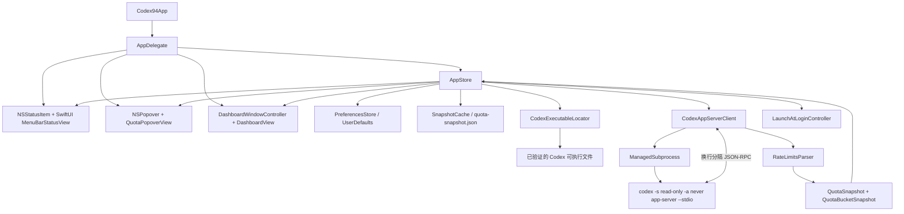

# Codex94 项目架构与后续规划上下文

> 目的：供 GPT Pro 或其他规划模型快速理解项目现状，并据此制定下一阶段升级计划。
>
> 稳定源码基线为 `v0.1.6`；本文描述已经发布的 Codex 0.149 兼容、
> 多额度桶与状态语义分离实现，不代表未来接口承诺。

## 1. 项目概览

Codex94 是一个非官方、独立的 macOS 菜单栏 Codex 额度监控工具。

主要体验：

- 菜单栏显示圆环和当前所选模型额度桶/窗口的剩余额度百分比。
- 点击菜单栏后打开 CLI 风格的额度 popover。
- popover 可独立浏览默认 Codex 与命名模型额度桶，并显示其可用额度窗口、
  剩余百分比、重置倒计时和连接状态。
- Dashboard 主要用于连接、显示、启动项、诊断和 About 设置。
- 没有 Dock 图标，普通启动时不自动打开 Dashboard。
- 支持 English、简体中文，以及系统、Terminal Dark、Terminal Light 主题。

当前范围：

- 读取当前 Codex 登录账号的额度。
- 支持默认 Codex 额度桶与服务端命名的额外模型额度桶；不同额度桶不会合并。
- 支持 5 小时和 Weekly 窗口；Codex 不返回某个窗口时自动隐藏。
- 菜单栏动态提供 `Auto` 与各额度桶/窗口组合；`Auto` 在所有可显示额度中选择
  剩余比例最低的一项。
- popover 浏览状态与菜单栏选择相互独立，浏览模型不会改变菜单栏圆环。
- 支持 1、5、15、30 分钟后台刷新，并在打开 popover 时刷新。
- 支持“额度 + 账号信息”和“仅额度”两种身份模式。
- 不支持多账号、多个 `CODEX_HOME`、额度历史、通知、WidgetKit、费用统计或自动更新。

## 2. 技术与构建基线

| 项目 | 当前值 |
| --- | --- |
| 平台 | macOS 14+ |
| 语言 | Swift 6 |
| UI | SwiftUI + AppKit |
| 项目形式 | `Codex94.xcodeproj` |
| Targets | App target + Unit Test target |
| Bundle ID | `com.defyan94.codex94` |
| App 类型 | `LSUIElement=true` 菜单栏 accessory app |
| App Sandbox | 关闭 |
| Hardened Runtime | 开启 |
| 运行时第三方依赖 | 无 |
| CI | GitHub Actions，macOS 15 runner，Xcode 16.4 |
| 本地安装 | `~/Applications/Codex94.app` |
| 当前分发 | 源码构建、ad-hoc 签名；无 DMG、公证二进制或自动更新 |
| License | MIT |

SwiftUI 负责视图和可观察状态展示；AppKit 负责 `NSStatusItem`、`NSPopover`、
Dashboard `NSWindow` 生命周期、外观应用和窗口事件。

## 3. 总体架构



核心依赖方向是 UI -> `AppStore` -> 服务/存储。UI 不直接访问 Codex、磁盘或认证状态。

## 4. App 生命周期与 AppKit 边界

### `Codex94/App/Codex94App.swift`

- SwiftUI `@main` 入口。
- 通过 `@NSApplicationDelegateAdaptor` 将实际生命周期交给 `AppDelegate`。
- SwiftUI `Settings` scene 为空；Dashboard 不是标准 Settings scene，而是自管 `NSWindow`。

### `Codex94/App/AppDelegate.swift`

主要职责：

- 将 App 设置为 `.accessory`，因此没有 Dock 图标。
- 创建固定宽度 `58pt` 的 `NSStatusItem`。
- 将 `MenuBarStatusView` 嵌入状态栏按钮。
- 创建固定 `500pt` 宽度、按当前内容自然调整高度的 transient `NSPopover`。
- 每次 popover 即将显示时调用 `store.popoverWillOpen()` 刷新。
- 用本地和全局鼠标监听补齐点击外部关闭行为。
- 创建并复用 `DashboardWindowController`。
- 使用 `NSOpenPanel` 选择手动 Codex 可执行文件。
- 观察主题设置，并同步应用到 App、状态栏、popover 和 Dashboard。

外部鼠标监听只在 popover 展开期间存在，关闭 popover 或退出 App 时立即移除。

### `Codex94/App/DashboardWindowController.swift`

- 管理可缩放 Dashboard 窗口。
- 使用 `.unifiedCompact` toolbar。
- 最小尺寸为 `900 x 600` points。
- 首次打开优先采用 Full HD 预设，并适配当前屏幕可用区域的 90%。
- 使用 frame autosave 恢复窗口位置和尺寸。
- 将用户手动 resize 同步为 `Custom` 状态。

## 5. 状态管理与刷新协调

### `Codex94/Stores/AppStore.swift`

`AppStore` 是当前应用的中心协调器，运行在 `@MainActor`，持有：

- 最新 `QuotaSnapshot`。
- 当前 popover 浏览的额度桶；该状态只存在于本次运行。
- 检测到的 `LocatedCodex`。
- `ConnectionState`。
- 刷新状态和最近错误。
- 基于实际菜单栏窗口和当前 popover 浏览窗口的两个只读 `StatusPresentation`
  投影；它们不改变刷新状态机。
- `PreferencesStore`。
- `LaunchAtLoginController`。
- `CodexExecutableLocator`、`QuotaFetching`、`SnapshotCache`。

刷新流程：

1. 读取手动路径和身份模式。
2. 在 detached utility task 中定位并验证 Codex。
3. 调用 `QuotaFetching.fetch(...)`。
4. 成功后更新 snapshot、连接状态并写入缓存。
5. 失败时保留最后一次成功 snapshot，并切换为 stale；无旧数据时显示 unavailable。

并发策略：

- 同一时间只允许一个刷新任务。
- 刷新进行中收到普通 refresh trigger 时直接合并。
- `preferenceChange` 会保留为一次 pending refresh，在当前刷新结束后再执行。
- 切换为“仅额度”会立即从内存 snapshot 移除 account 信息。
- 即使旧请求在切换身份模式后才返回，成功结果也会再次按当前身份模式过滤。

后台刷新使用一个长期 `Task` 配合 `Task.sleep`，修改刷新间隔时取消并重建任务。

### 连接状态

`ConnectionState` 包含：

- `idle`
- `refreshing`
- `connected`
- `stale(lastSuccess, issue)`
- `unavailable(issue)`

错误被规范化为 `ConnectionIssue`，UI 只显示本地化分类，不展示原始 RPC payload 或 stderr。

展示层把额度与连接/数据新鲜度作为两个独立维度：`QuotaLevel` 只由剩余百分比
决定，`ConnectionBadge` 则区分 refreshing、cached 和 unavailable。已有缓存数据
重试时，Badge 优先显示 refreshing，同时保留 cached 上下文与最后成功时间。

## 6. Codex 可执行文件发现与验证

### `Codex94/Services/CodexExecutableLocator.swift`

自动发现顺序：

1. 用户手动选择路径。
2. `/Applications/ChatGPT.app/Contents/Resources/codex`。
3. `/opt/homebrew/bin/codex`。
4. `/usr/local/bin/codex`。
5. `~/.local/bin/codex`。
6. `PATH` 中的绝对目录。

验证要求：

- 文件存在且可执行。
- 执行 `codex --version` 成功退出。
- 最长等待 3 秒。
- 输出上限 1 KiB。
- 输出必须是单行可打印 ASCII，并以 `codex-cli ` 开头。
- 最终路径会解析符号链接。

传给子进程的环境只保留：

- `HOME`
- 经过清理、只含绝对目录的 `PATH`
- `TMPDIR`
- `LANG`、`LC_ALL`、`LC_CTYPE`

App 不验证可执行文件的开发者签名或发布者身份；版本验证只代表协议兼容性。

## 7. app-server RPC 与进程管理

### `Codex94/Services/CodexAppServerClient.swift`

固定启动命令：

```text
codex -s read-only -a never app-server --stdio
```

工作目录：

```text
~/Library/Application Support/Codex94/Runtime
```

目录权限为 `0700`。

每次 fetch 的 RPC 顺序：

1. `initialize`
2. `initialized`
3. 可选 `account/read`，固定 `refreshToken: false`
4. `account/rateLimits/read`

默认超时和边界：

| 项目 | 值 |
| --- | --- |
| initialize timeout | 8 秒 |
| 单请求 timeout | 5 秒 |
| 总 fetch timeout | 15 秒 |
| 单行最大响应 | 1 MiB |
| 终止宽限 | 1 秒 |

`JSONLineChannel` 使用 `poll` + `read` 读取换行 JSON，支持：

- 忽略异步通知。
- 忽略不匹配的 response ID。
- 识别服务端 error、缺失 result、malformed JSON、超大响应、超时和提前退出。

### `Codex94/Services/ProcessTerminator.swift`

- 直接使用 `posix_spawn`，不经过 shell。
- stdin/stdout 显式连接 Pipe，stderr 指向 `/dev/null`。
- 使用 `POSIX_SPAWN_CLOEXEC_DEFAULT` 控制文件描述符继承。
- 为 Codex 建立独立进程组，以清理其派生 helper。
- 正常结束先向进程组发送 `SIGTERM`。
- 宽限期后仍存活则发送 `SIGKILL`。
- 最终 `waitpid` 回收直接子进程。

当前设计是每次刷新启动一个新的 app-server，刷新结束后终止整个进程组。

## 8. 额度解析与领域模型

### 主要模型

- `QuotaWindowKind`: `fiveHour`、`weekly`。
- `QuotaWindowSnapshot`: used、window duration、reset time，并计算 remaining。
- `QuotaBucketSnapshot`: `limitId`、可选 `limitName`、plan 与该额度桶自己的窗口。
- `QuotaSnapshot`: buckets、默认额度桶 ID、fetch time、可选 account、可选 Codex 信息。
- `AccountSummary`: type、email、plan。
- `MenuBarQuotaSelection`: `automatic`、默认额度桶的具体窗口，或指定 `limitId`
  的具体窗口。
- `IdentityMode`: quotaAndAccount、quotaOnly。

百分比定义：

```text
remainingPercent = clamp(100 - usedPercent, 0...100)
```

`Auto` 在所有可显示额度桶和窗口中选择 remaining 最低的一项。相同 remaining
按默认额度桶优先、名称、ID 和窗口类型稳定排序，避免菜单栏无意义跳动。
具体菜单栏选择指向的额度桶或窗口暂时消失时，运行时显示回退到 Auto，但不覆盖
UserDefaults 中的用户偏好；对应额度恢复后自动恢复原选择。

服务端的额度桶 ID 被视为不可解释的标识：默认额度桶统一显示为 **Codex**，
额外额度桶只有在具有服务端名称与有效窗口时才进入 UI，例如 **Spark**。实现不
硬编码某个 Spark ID，也不根据 ID 猜测模型名称；同名额外额度桶按 ID 稳定排序
并添加序号，避免选择器出现无法区分的重复标签。

### `RateLimitsParser`

解析同时兼容当前多桶响应和旧单桶响应：

1. 遍历 `rateLimitsByLimitId`，以 map key 作为权威 `limitId`。
2. 同一 ID 下以 map 数据为主，顶层兼容字段 `rateLimits` 只补充缺失信息。
3. map 缺失时，将旧 `rateLimits` 包装成默认额度桶。
4. 保留默认额度桶；额外额度桶必须具有名称和至少一个有效窗口才展示。

每个额度桶独立检查 `primary` 和 `secondary`，并根据服务端时长分类：

- 240...360 分钟 -> 5 小时窗口。
- 9,000...11,000 分钟 -> Weekly 窗口。
- 其他时长忽略。

null、未知或损坏的单个窗口只影响自身，不会丢弃同一响应内的其他合法窗口，
也不会把不同额度桶的窗口拼接在一起。

当前 parser 使用 `[String: Any]` 和运行时类型转换，不使用强类型 Codable RPC DTO。

## 9. UI 结构

### 菜单栏

`MenuBarStatusView` 显示：

- `16pt` 圆环。
- 固定宽度等宽百分比文本。
- refreshing、cached、unavailable 使用形状不同的蓝色/青色 Badge；connected 和
  idle 不增加额外图形。

颜色按剩余额度计算：

- `>= 50%`: 绿色。
- `20%...49%`: 琥珀色。
- `< 20%`: 红色。
- 无数据: 灰色。

连接状态不会覆盖额度颜色；stale snapshot 继续显示最后已知的绿色、琥珀色或
红色额度，无 snapshot 时显示灰色 `--`。

### Popover

`QuotaPopoverView` 包含：

- 模型额度桶选择器；一次浏览一个桶，并与菜单栏选择相互独立。
- 当前额度桶名称、圆环、plan、该桶最紧张窗口的百分比和连接状态。
- 当前额度桶自己的 5h/Weekly 条形额度行。
- 20 段 CLI 风进度条。
- reset 倒计时。
- 使用独立 connection accent 的 cached/unavailable banner。
- Refresh、Dashboard、Quit 命令行式操作。
- 首次启动的身份模式选择页。

窗口不存在时不会渲染对应额度行。当前浏览的额外额度桶消失时，popover 在本次
运行中回到默认额度桶；该浏览状态本身不写入持久化设置。

### Dashboard

`DashboardView` 使用 `NavigationSplitView`，页面包括：

- Connection: 状态、刷新频率、Codex 路径/版本、身份模式、可选账号邮箱。
- Display: 动态菜单栏额度选择、Dashboard 尺寸、主题、语言。
- Startup: 登录时启动。
- Diagnostics: 脱敏诊断和复制按钮。
- About: App 元数据、MIT、最低系统、制作人和非官方声明。

Dashboard 使用自定义固定位置 sidebar toggle，并移除系统默认 toggle。

### 本地化和主题

- 文案集中在 `Codex94/Localizable.xcstrings`。
- 当前语言为 English 和简体中文。
- 语言覆盖通过 SwiftUI `environment(\.locale, ...)` 实现。
- 主题选择通过 AppKit `NSAppearance` 同步到各窗口表面。
- 色彩集中在 `Codex94Palette`；quota severity 与 connection accent 使用独立 token。

## 10. 持久化、隐私与诊断

### UserDefaults

`PreferencesStore` 保存：

- 菜单栏额度选择，包括 Auto 或具体额度桶/窗口。
- identity mode。
- refresh interval。
- theme。
- language。
- 可选手动 Codex 路径。
- 是否已完成首次身份模式选择。

### 额度缓存

文件：

```text
~/Library/Application Support/Codex94/quota-snapshot.json
```

cache schema v2 只保存：

- schema version、默认额度桶 ID。
- 每个额度桶的 ID、可选名称与 plan type。
- 窗口类型、`windowMinutes`、used percentage 与 reset time。
- fetched time。

不保存 email、account ID、token、RPC payload 或 Codex 路径。目录权限 `0700`，文件权限 `0600`，写入使用 atomic option。

无版本的旧单桶缓存会迁移为一个默认额度桶；旧
`automatic / fiveHour / weekly` 偏好会迁移为 Auto 或默认额度桶对应窗口，
不会假设默认额度桶 ID 永远是固定字符串。popover 当前浏览的模型只保存在内存，
不写入 UserDefaults。

### 诊断脱敏

`DiagnosticsRedactor`：

- 标准 Codex 来源转换为规范路径。
- 手动路径和 PATH 来源统一为 `<redacted-path>/codex`。
- 版本只允许 64 字符以内的安全 token。
- 可移除 home directory 和 email。
- 复制诊断只写入系统剪贴板，不主动上传。

### 明确不做的事情

Codex94 不：

- 读取 `auth.json`。
- 实现 OAuth 或读取/交换 OAuth token。
- 读取浏览器 cookie。
- 读取 Keychain。
- 读取 Codex session 日志或 SQLite。
- 直接调用 ChatGPT/OpenAI usage HTTP endpoint。
- 保存或输出 access/refresh token。
- 上传 analytics、telemetry 或 crash report。

App Sandbox 关闭是为了让第一方 Codex 子进程访问其已有登录状态；Hardened Runtime 保持开启。

## 11. 目录与模块职责

| 路径 | 职责 |
| --- | --- |
| `Codex94/App/` | App 入口、AppKit 生命周期、Dashboard 窗口控制 |
| `Codex94/Models/QuotaModels.swift` | 额度、账号、连接状态、设置枚举 |
| `Codex94/Models/DashboardWindowSize.swift` | 窗口预设、屏幕适配、Custom 状态 |
| `Codex94/Stores/AppStore.swift` | 中心状态与刷新协调 |
| `Codex94/Stores/PreferencesStore.swift` | UserDefaults 设置持久化 |
| `Codex94/Services/CodexExecutableLocator.swift` | Codex 发现与版本验证 |
| `Codex94/Services/CodexAppServerClient.swift` | JSON-RPC、超时、额度解析 |
| `Codex94/Services/ProcessTerminator.swift` | 安全启动和回收进程组 |
| `Codex94/Services/SnapshotCache.swift` | 最小额度缓存 |
| `Codex94/Services/LaunchAtLoginController.swift` | `SMAppService.mainApp` |
| `Codex94/Views/MenuBar/` | 菜单栏和 popover |
| `Codex94/Views/Dashboard/` | Dashboard 各设置页 |
| `Codex94/Views/Components/` | 条形进度和圆环组件 |
| `Codex94/Support/` | 格式化、本地化、主题、脱敏、App metadata |
| `Codex94Tests/` | 单元测试和 fake app-server 集成测试 |
| `script/` | build、install、release gate、安全扫描、图标生成 |
| `.github/` | CI、Dependabot、Issue/PR 模板 |

## 12. 测试与交付体系

XCTest 测试套件覆盖：

- 多额度桶解析、窗口分类、remaining 计算、全局 Auto 选择和 null 窗口。
- reset/stale/标题/百分比格式化与中英文本地化。
- Codex 查找顺序、PATH 清理、版本输出限制和超时。
- app-server initialize、异步通知、错误、缺失 result、malformed JSON、超大行、超时、提前退出和进程清理。
- AppStore 身份模式切换与 in-flight refresh 竞态。
- cache v1 -> v2、旧偏好迁移、缓存权限和身份数据排除。
- popover 浏览与菜单栏选择相互独立，以及额度桶暂时消失后的运行时回退/恢复。
- quota 阈值、连接 Badge 优先级、stale 重试缓存上下文和无 snapshot 的 unknown
  状态。
- 诊断路径、版本、home directory 和 email 脱敏。
- Dashboard 窗口预设和 metadata fallback。

测试层级目前以 unit test 和 fake subprocess integration test 为主，没有独立 UI automation target。

主要命令：

```bash
./script/build_and_run.sh
./script/build_and_run.sh --verify
./script/security_check.sh
./script/release_check.sh
./script/install.sh
```

`release_check.sh` 会执行：

1. Git diff whitespace 检查。
2. plist 和 String Catalog 语法检查。
3. 静态安全扫描。
4. Debug XCTest。
5. Release build。
6. 严格 codesign 验证。
7. Hardened Runtime 检查。
8. 拒绝 Release `get-task-allow` entitlement。

CI 在 push 到 `main` 和 pull request 时运行同一个 release gate。Actions checkout 固定到完整 commit SHA，workflow token 仅有 `contents: read`。

## 13. 当前架构优点

- 安全边界明确：App 不直接接触 Codex 凭据。
- 不经过 shell，命令参数固定，环境和输出均受限。
- 默认额度桶与命名模型额度桶在解析、选择和缓存中保持独立。
- 进程组回收和 timeout 防止 app-server 残留。
- UI、状态、服务和存储已有基本分层。
- `QuotaFetching` 协议允许注入 fake fetcher。
- 额度缓存最小化并使用 owner-only 权限。
- stale 状态允许网络或 Codex 临时失败时继续显示最后成功数据。
- 对 weekly-only 场景已有完整兼容。
- 零第三方运行时依赖，供应链表面较小。
- 构建、测试、安全检查和 Release gate 已脚本化。

## 14. 当前限制与技术债

以下内容适合作为升级规划输入，不代表必须全部修改。

### 协议与数据模型

- `app-server` 是实验接口，可能发生字段或方法变化。
- RPC 和额度解析大量使用 `[String: Any]`，缺少强类型 envelope/DTO 和版本适配层。
- 每个额度桶目前只检查 `primary`、`secondary`，并用窗口分钟数推断
  5h/Weekly；其他窗口时长会安全忽略。
- 额外额度桶必须具有服务端名称才进入 UI，无名称的未来 capability 暂不展示。
- 不展示 credits、月额度、reset credits 或未来可能出现的新窗口类型。

### 并发与进程生命周期

- `CodexAppServerClient` 是 `@unchecked Sendable`，同步 POSIX IO 通过 serial queue 桥接 async。
- Swift Task cancellation 不会立即中断同步 fetch，只能等待内部 deadline 和 defer 清理。
- 每次刷新都新建 app-server，简单且隔离，但存在启动成本。
- 当前 refresh coalescing 只保证 preference change 最终重跑；其他重复触发会被丢弃。

### 状态与模块边界

- `AppStore` 同时负责刷新调度、身份过滤、缓存、错误状态、显示选择和诊断组装，职责逐渐集中。
- `DashboardView.swift` 约 523 行，`QuotaPopoverView.swift` 约 372 行，继续扩展会降低可维护性。
- 连接状态是单一枚举，尚未区分 executable、RPC、auth、quota capability 等更细阶段。

### UI 与产品能力

- 没有 WidgetKit、通知、历史趋势、菜单栏仅图标模式或多账号。
- 没有 UI automation、Accessibility audit 或稳定截图测试 target。
- 部分动态格式字符串由 Swift 直接拼接，若继续扩展语言需要更完整的 String Catalog interpolation 策略。
- popover 固定 `500pt` 宽度并按内容自然调整高度；Dynamic Type 和超长本地化
  仍受到固定宽度约束。

### 发布与运维

- 只有源码安装和 ad-hoc 签名。
- 没有 Developer ID、notarization、DMG、Sparkle/系统更新机制或 GitHub binary release。
- 没有运行时 crash reporting；当前仅使用隐私受控的 Unified Logging。
- 远程 GitHub rulesets、CodeQL、Secret Scanning 等管理员设置不在代码仓库内，应在发布流程中单独复核。

## 15. 升级时应保持的约束

除非明确做出新的产品和安全决策，升级计划应保持：

1. 不读取、导出或持久化 Codex/OpenAI token。
2. 不读取浏览器 cookie、Keychain、`auth.json`、session 日志或 SQLite。
3. 不把邮箱、账号 ID、RPC payload、完整自定义路径写入日志或缓存。
4. Codex 子进程不经过 shell，参数不可由任意用户文本拼接。
5. 保持 read-only sandbox 与 `-a never` 非交互 approval 参数。
6. 保留响应上限、timeout、进程组终止和环境清理。
7. 5h 缺失时不伪造、不占位为官方额度。
8. live quota 失败时显示 unavailable/stale，而不是本地估算百分比。
9. 继续支持 ChatGPT App 内置 Codex，不强制单独安装 CLI。
10. 后续持久化 schema 必须从 cache v2 可迁移，并默认最小化数据。
11. 任何直接网络 fallback、常驻 app-server、多账号或 `CODEX_HOME` 支持都必须单独 threat model。
12. 发布功能必须区分本地 ad-hoc 构建与经过 Developer ID + notarization 的公开二进制。

## 16. 交给 GPT Pro 的规划问题

建议让规划模型先回答这些决策，再输出版本计划：

### 产品方向

- 下一版本主要目标是可靠性、UI 重构、更多额度类型，还是公开二进制分发？
- 是否继续以菜单栏为唯一核心，Dashboard 只做设置？
- 是否需要历史数据、通知、WidgetKit 或多账号？
- 新功能是否值得扩大当前本地数据存储范围？

### RPC 和兼容性

- 如何将 transport、JSON-RPC envelope、Codex schema adapter 和 domain model 分离？
- 如何在未知字段、新窗口和 `rateLimitsByLimitId` 继续变化时保持当前多桶兼容？
- 是否保留 one-shot app-server，还是设计可控的短期复用会话？
- 如何让 Task cancellation 能立即终止正在进行的子进程？

### 架构

- 是否拆分 `AppStore` 为 refresh coordinator、quota repository、connection state machine 和 presentation store？
- 是否把 `DashboardView` 与 `QuotaPopoverView` 按页面/组件拆分？
- 哪些接口需要先稳定，避免为了重构一次性改动 UI、RPC 和缓存三层？

### 质量与发布

- 哪些 UI 状态必须增加 screenshot/UI tests？
- 是否开始 Developer ID、notarization、DMG 和更新机制？
- 是否保持零第三方依赖；如果引入依赖，如何评估许可证和供应链风险？
- 如何设计缓存迁移、回滚、兼容旧设置和发布验收？

## 17. 建议 GPT Pro 使用的请求模板

```text
请根据随附的 Codex94 项目架构文档，为下一版本制定可执行升级计划。

要求：
1. 先总结你理解的当前架构、关键数据流和安全边界。
2. 区分“必须修复”“架构改进”“可选产品功能”“发布基础设施”。
3. 不要默认读取 token、cookie、Keychain、auth.json、session 日志或 SQLite。
4. 不要在没有 threat model 的情况下增加直接 HTTP fallback、常驻 app-server 或多账号。
5. 保持菜单栏优先、多额度桶隔离、weekly-only 兼容、stale fallback 和隐私最小化。
6. 给出分阶段版本计划、涉及文件、数据迁移、测试、风险、回滚方案和完成标准。
7. 明确哪些决策需要产品负责人先确认，不要自行假设。
8. 优先提出最小、可验证、可回退的改动，避免一次性重写。
```

## 18. 规划前应再次核对的文件

GPT Pro 在提出具体改动前，应优先阅读：

1. `Codex94/Stores/AppStore.swift`
2. `Codex94/Services/CodexAppServerClient.swift`
3. `Codex94/Services/CodexExecutableLocator.swift`
4. `Codex94/Services/ProcessTerminator.swift`
5. `Codex94/Models/QuotaModels.swift`
6. `Codex94/App/AppDelegate.swift`
7. `Codex94/Views/MenuBar/QuotaPopoverView.swift`
8. `Codex94/Views/Dashboard/DashboardView.swift`
9. `Codex94Tests/`
10. `SECURITY.md`、`PRIVACY.md` 和 `script/release_check.sh`

本文可作为规划上下文，但源码仍是最终事实来源。
